# Frontend Navigation Graph

Navigation / UI-surface graph for the WorshipViewer frontend (`frontend/app/src`), derived from `routeTree.gen.ts` + components + `i18n/en.json`.

- **Nodes** = screens (TanStack Router routes) and overlay surfaces (dialogs, sheets, menus, popovers, panels).
- **Edges** = user-triggered transitions, annotated with the trigger label (button text / aria label / keyboard shortcut / condition).

## Node types

| Type | Meaning |
|------|---------|
| `screen` | Full route rendered by TanStack Router |
| `overlay` | Dialog / alert / sheet / menu / popover (modal or transient surface) |
| `panel` | Toggleable in-screen panel / chrome (not a separate route) |
| `external` | URL or window outside the in-app router |

## Edge types

| Type | Meaning | Mermaid style |
|------|---------|---------------|
| `navigate` | Client-side router navigation (`useNavigate` / `<Link>`) | `-->` |
| `redirect` | Programmatic redirect (`throw redirect` / `beforeLoad`) | `-->` |
| `open` | Opens an overlay/panel | `-.->` |
| `close` | Closes an overlay/panel | `-.->` |
| `external` | Hard navigation (`window.location.assign` / `window.open`) | `==>` |

Edge style legend in the diagram: solid `-->` route navigation/redirect, dotted `-.->` overlay open/close, `==>` external/window.

```mermaid
graph TD
    %% ---- Screens ----
    index["/ Index"]
    login["/login"]
    logout["/logout"]
    join["/join"]
    notFound["/$ Not Found"]
    collections["/collections"]
    collectionDetail["/collections/:id"]
    songs["/songs"]
    songDetail["/songs/:id"]
    setlists["/setlists"]
    setlistDetail["/setlists/:id"]
    teams["/teams"]
    teamDetail["/teams/:id"]
    sessions["/sessions"]
    settings["/settings"]
    about["/about"]
    playerNormal["/player (Normal)"]
    playerAv["/player (AV)"]
    playerOutput["/player/output"]

    %% ---- Overlays / chrome ----
    profileMenu(["Profile menu"])
    commandPalette(["Command palette"])
    pwaInstallSheet(["PWA install sheet"])

    %% ---- Auth / entry redirects ----
    index -->|"redirect (authed)"| collections
    index -->|"auth redirect"| login
    logout -->|"redirect"| login
    login -->|"Verify and sign in"| index
    login ==>|"Login with Google"| googleOAuth(["Google OAuth"])
    join -->|"invite accepted"| teamDetail
    join -->|"Back to teams"| teams
    join -->|"auth redirect"| login
    notFound -->|"Back home"| collections
    notFound -->|"Sign out"| login

    %% ---- Collections ----
    collections -.->|"Add FAB"| createCollectionDialog(["Create collection"])
    createCollectionDialog -->|"Create"| collectionDetail
    createCollectionDialog -.->|"Cancel (close)"| collections
    collections -->|"row tap"| playerNormal
    collections -.->|"right-click / long-press"| ctxMenu(["List context menu"])
    ctxMenu -->|"Edit / Duplicate"| collectionDetail
    ctxMenu -->|"Play Normal"| playerNormal
    ctxMenu -->|"Play AV"| playerAv
    ctxMenu -.->|"Delete"| deleteAlert(["Delete confirm"])
    collectionDetail -->|"Back"| collections
    collectionDetail -->|"Back (player return)"| playerNormal
    collectionDetail -.->|"Move / swipe-left"| moveSongDialog(["Move song dialog"])

    %% ---- Songs ----
    songs -.->|"Add FAB"| songChooser(["Song create chooser"])
    songChooser -.->|"New song"| createSongDialog(["Create song"])
    songChooser -.->|"Import files"| importSongsDialog(["Import songs"])
    createSongDialog -->|"Create"| songDetail
    songs -->|"row tap"| playerNormal
    songs -.->|"context menu"| ctxMenu
    songs -.->|"Add to setlist"| addToSetlist(["Add to setlist dialog"])
    songDetail -->|"Back"| songs
    songDetail -->|"Back (player return)"| playerNormal

    %% ---- Setlists ----
    setlists -.->|"Add FAB"| createSetlistDialog(["Create setlist"])
    createSetlistDialog -->|"Create"| setlistDetail
    setlists -->|"row tap"| playerNormal
    setlists -.->|"context menu"| ctxMenu
    ctxMenu -->|"Edit / Duplicate (setlist)"| setlistDetail
    setlistDetail -->|"Play"| playerNormal
    setlistDetail -->|"Back"| setlists
    setlistDetail -.->|"Add songs"| pickerSheet(["Song picker sheet"])
    pickerSheet -.->|"Song row tap (insert + close)"| setlistDetail
    setlistDetail -.->|"Key chip"| keyPicker(["Key picker popover"])

    %% ---- Teams / Sessions ----
    teams -.->|"Add FAB"| createTeamDialog(["Create team"])
    createTeamDialog -->|"Create"| teamDetail
    teams -->|"row click"| teamDetail
    teamDetail -->|"Back"| teams
    teamDetail -.->|"Invite"| inviteDialog(["Invite link dialog"])
    teamDetail -.->|"Delete team"| deleteTeamAlert(["Delete team confirm"])
    deleteTeamAlert -->|"Delete (success)"| teams
    sessions -.->|"Revoke"| revokeAlert(["Revoke session confirm"])

    %% ---- Settings ----
    settings -->|"Back to library"| collections
    settings -->|"Back (player return)"| playerNormal
    settings -->|"Teams"| teams
    settings -->|"Sessions"| sessions
    settings -->|"Log out"| login

    %% ---- About ----
    about -->|"Back to library"| collections
    about -->|"Back (player return)"| playerNormal

    %% ---- Player (Normal) ----
    playerNormal -->|"Back to list (collection) / Esc"| collections
    playerNormal -->|"Back to list (song) / Esc"| songs
    playerNormal -->|"Back to list (setlist) / Esc"| setlists
    playerNormal -->|"settings gear"| settings
    playerNormal -->|"Edit song (e)"| songDetail
    playerNormal -->|"Edit setlist"| setlistDetail
    playerNormal -->|"Edit collection"| collectionDetail
    playerNormal -.->|"center tap / m"| playerChrome(["Player chrome + TOC"])
    playerNormal -.->|"Transpose / A-G"| transposePopover(["Transpose popover"])

    %% ---- Player (AV) ----
    playerAv -->|"Back / Esc"| collections
    playerAv -->|"AV settings gear"| settings
    playerAv ==>|"Open output (O)"| playerOutput
    playerAv -.->|"slides panel"| avSlides(["AV slides panel"])
    playerAv -.->|"outline panel"| avOutline(["AV outline panel"])
    avSlides -.->|"Background"| avBackground(["AV background selector"])

    %% ---- Global hub chrome (available on every /_hub/* screen) ----
    profileMenu -->|"Settings"| settings
    profileMenu -->|"About"| about
    profileMenu -->|"Teams"| teams
    profileMenu -->|"Sessions"| sessions
    profileMenu -->|"Log out"| login
    profileMenu -.->|"Install app"| pwaInstallSheet
    commandPalette -->|"Navigate > Collections"| collections
    commandPalette -->|"Navigate > Songs"| songs
    commandPalette -->|"Navigate > Setlists"| setlists
    commandPalette -->|"Navigate > Settings"| settings
    commandPalette -->|"Navigate > Teams"| teams
    commandPalette -->|"Navigate > Sessions"| sessions
    commandPalette -.->|"Install app"| pwaInstallSheet
```

> Profile menu (avatar) and command palette (Cmd/Ctrl+K, pointer:fine only) are rendered by `HubShell` on every `/_hub/*` screen, so their edges apply from any hub screen.

## Node reference

### Screens

| Node | Route | Source file |
|------|-------|-------------|
| `index` | `/` | `routes/index.tsx` |
| `login` | `/login` | `routes/login.tsx` |
| `logout` | `/logout` | `routes/logout.tsx` |
| `join` | `/join` | `routes/join.tsx` |
| `notFound` | `/$` | `routes/$.tsx` |
| `collections` | `/collections` | `routes/_hub/collections.tsx` |
| `collectionDetail` | `/collections/$collectionId` | `routes/_hub/collections.$collectionId.tsx` |
| `songs` | `/songs` | `routes/_hub/songs.tsx` |
| `songDetail` | `/songs/$songId` | `routes/_hub/songs.$songId.tsx` |
| `setlists` | `/setlists` | `routes/_hub/setlists.tsx` |
| `setlistDetail` | `/setlists/$setlistId` | `routes/_hub/setlists.$setlistId.tsx` |
| `teams` | `/teams` | `routes/_hub/teams.tsx` |
| `teamDetail` | `/teams/$teamId` | `routes/_hub/teams.$teamId.tsx` |
| `sessions` | `/sessions` | `routes/_hub/sessions.tsx` |
| `settings` | `/settings` | `routes/_hub/settings.tsx` |
| `about` | `/about` | `routes/_hub/about.tsx` |
| `playerNormal` | `/player?mode=normal` | `components/player/PlayerBook.tsx` |
| `playerAv` | `/player?mode=av` | `components/player/av/PlayerAv.tsx` |
| `playerOutput` | `/player/output` | `routes/player/output.tsx` |
| `playerRooms` | `/player-rooms` | `routes/_hub/player-rooms.tsx` |
| `playerRoomLive` | `/player/room/:roomId` | `routes/player/room.$roomId.tsx` |
| `playerRoomInvite` | `/player-rooms/invite#secret` | `routes/player-rooms.invite.tsx` |

### Overlays / panels

| Node | Type | Source file |
|------|------|-------------|
| Profile menu (`profileMenu`) | overlay | `components/hub/ProfileMenu.tsx` |
| Command palette (`commandPalette`) | overlay | `components/hub/CommandPalette.tsx` |
| PWA install help sheet (`pwaInstallSheet`) | overlay | `pwa/PwaInstallProvider.tsx` |
| List item context menu (`ctxMenu`) | overlay | `components/hub/EntityListView.tsx` |
| Delete item confirmation (`deleteAlert`) | overlay | `components/hub/EntityListView.tsx` |
| Add song to setlist dialog (`addToSetlist`) | overlay | `components/hub/AddSongToSetlistDialog.tsx` |
| Create collection dialog (`createCollectionDialog`) | overlay | `components/collections/CreateCollectionDialog.tsx` |
| Create setlist dialog (`createSetlistDialog`) | overlay | `components/setlists/CreateSetlistDialog.tsx` |
| Create team dialog (`createTeamDialog`) | overlay | `components/teams/CreateTeamDialog.tsx` |
| Song create chooser sheet (`songChooser`) | overlay | `components/songs/SongCreateChooserSheet.tsx` |
| Create song dialog (`createSongDialog`) | overlay | `components/songs/CreateSongDialog.tsx` |
| Import songs dialog (`importSongsDialog`) | overlay | `components/songs/ImportSongsDialog.tsx` |
| Invite link dialog (`inviteDialog`) | overlay | `components/teams/TeamDetailView.tsx` |
| Delete team confirmation (`deleteTeamAlert`) | overlay | `components/teams/TeamDetailView.tsx` |
| Revoke session confirmation (`revokeAlert`) | overlay | `components/sessions/SessionsListView.tsx` |
| Setlist song picker sheet (`pickerSheet`) | overlay | `components/setlists/SetlistSongPickerSheet.tsx` |
| Key picker popover (`keyPicker`) | overlay | `components/setlists/SetlistEditorScreen.tsx` |
| Move song to collection dialog (`moveSongDialog`) | overlay | `components/collections/MoveSongToCollectionDialog.tsx` |
| Player chrome + TOC sidebar (`playerChrome`) | panel | `components/player/PlayerBook.tsx` |
| Transpose popover (`transposePopover`) | overlay | `components/player/PlayerBook.tsx` |
| AV slides panel (`avSlides`) | panel | `components/player/av/AvSlidesPanel.tsx` |
| AV background selector (`avBackground`) | panel | `components/player/av/AvBackgroundSelector.tsx` |
| AV outline panel (`avOutline`) | panel | `components/player/av/AvOutlinePanel.tsx` |
| Google OAuth (`googleOAuth`) | external | `routes/login.tsx` (`/auth/login`) |

## Notes

- Hub chrome (Profile menu, Command palette) is rendered on every `/_hub/*` screen via `HubShell`; edges from `profileMenu`/`commandPalette` therefore apply from any hub screen.
- Command palette opens with Cmd/Ctrl+K and only on `pointer:fine` devices.
- Footer Add FAB is hidden on `/sessions`, `/settings`, and all detail/editor routes.
- `playerNormal` and `playerAv` are the same `/player` route; the active surface is chosen by the `mode` search param.
- Player Rooms are opened from the profile menu or a source player. Public invite routes remain outside both authenticated route guards.
- Auth: any protected route redirects to `/login?return_to=<path>` when there is no session; an API 401 hard-redirects to `/login`.
- `SongEditorActionsMenu` exists in the codebase but is not currently wired into `SongEditorScreen`, so it is omitted from the live graph.
