# Frontend User Flows (fine-grained)

Atomic, task-level user flows for the WorshipViewer frontend (`frontend/app/src`),
derived from the [navigation graph](./frontend-navigation-graph.md) and the live
component code.

Each entry is **one concrete thing a user can do**, with every reachable variant and
outcome. Decision diamonds mark branches; rounded nodes are start/end; rectangles are
steps; `-.->` marks an overlay open/close, `==>` an external/window action.

Cross-cutting rules used throughout:

- **Personal team** = team whose API name is `personal`; shown as **"My Team"** (you own it) or **"{email}'s Team"**.
- **Library edit access** (`canEditTeamLibrary`) = team `admin` or `content_maintainer` role; personal-team owner always counts as admin.
- **Add (+) FAB** is online-only and hidden on detail/editor/sessions/settings routes.
- **Command palette** (⌘K/Ctrl+K) only exists on `pointer:fine` (desktop) devices.
- **Editors autosave** (no Save button): songs 3000 ms debounce, collections/setlists 750 ms.
- **Owner picker** in create-collection/setlist dialogs appears only when the user can edit **2+** teams; with 0–1 writable teams `owner` is omitted and the server uses the personal team.

## Index

- [A. Authentication & entry](#a-authentication--entry)
- [B. Teams](#b-teams)
- [C. Collections — create & manage](#c-collections--create--manage)
- [D. Songs — create, import & manage](#d-songs--create-import--manage)
- [E. Setlists — create & manage](#e-setlists--create--manage)
- [F. Moving / adding songs between containers](#f-moving--adding-songs-between-containers)
- [G. Editors (song / collection / setlist)](#g-editors)
- [H. Player — Normal mode](#h-player--normal-mode)
- [I. Player — AV mode & projection](#i-player--av-mode--projection)
- [J. Settings & preferences](#j-settings--preferences)
- [K. Sessions](#k-sessions)
- [L. Hub lists: search, browse, export, duplicate, delete](#l-hub-lists)

---

## A. Authentication & entry

### A1. Sign in with email one-time code

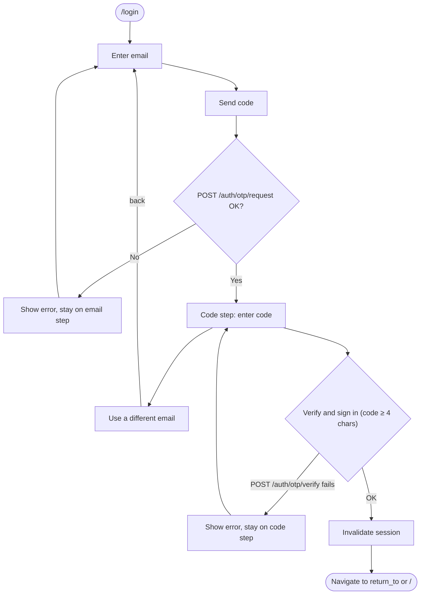
```mermaid
flowchart TD
    s(["/login"]) --> email["Enter email"]
    email --> send["Send code"]
    send --> req{POST /auth/otp/request OK?}
    req -->|No| err1["Show error, stay on email step"] --> email
    req -->|Yes| code["Code step: enter code"]
    code --> diff["Use a different email"] -->|back| email
    code --> verify{"Verify and sign in (code ≥ 4 chars)"}
    verify -->|POST /auth/otp/verify fails| err2["Show error, stay on code step"] --> code
    verify -->|OK| inv["Invalidate session"] --> dest(["Navigate to return_to or /"])
```

### A2. Sign in with Google

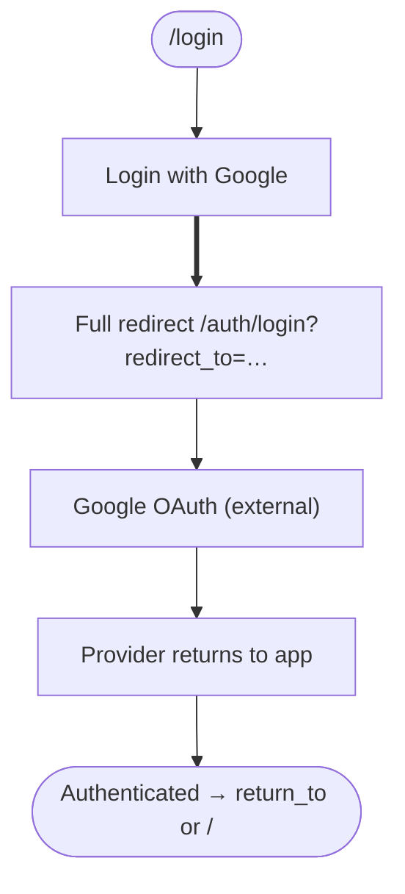
```mermaid
flowchart TD
    s(["/login"]) --> g["Login with Google"]
    g ==> ext["Full redirect /auth/login?redirect_to=…"]
    ext --> prov["Google OAuth (external)"]
    prov --> back["Provider returns to app"]
    back --> dest(["Authenticated → return_to or /"])
```

### A3. Already-signed-in / index / 404 redirects

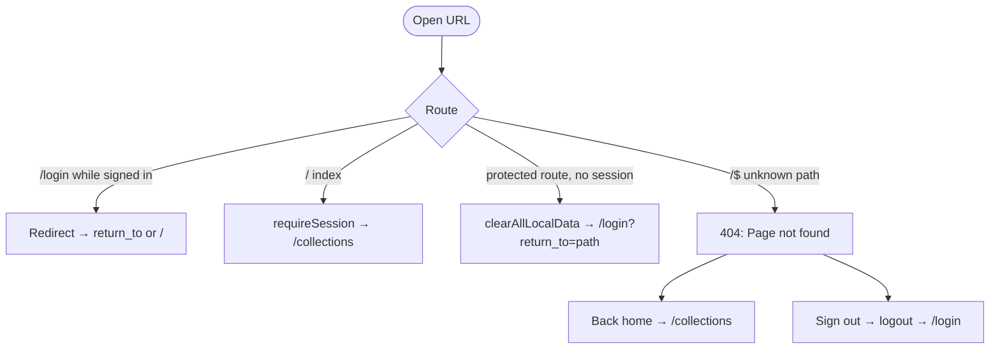
```mermaid
flowchart TD
    open(["Open URL"]) --> which{Route}
    which -->|/login while signed in| r1["Redirect → return_to or /"]
    which -->|/ index| r2["requireSession → /collections"]
    which -->|protected route, no session| r3["clearAllLocalData → /login?return_to=path"]
    which -->|/$ unknown path| nf["404: Page not found"]
    nf --> home["Back home → /collections"]
    nf --> so["Sign out → logout → /login"]
```

### A4. Log out

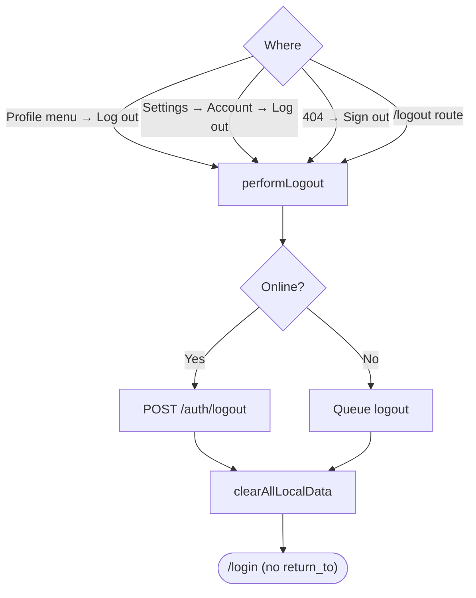
```mermaid
flowchart TD
    src{Where}
    src -->|Profile menu → Log out| lo
    src -->|Settings → Account → Log out| lo
    src -->|404 → Sign out| lo
    src -->|/logout route| lo
    lo["performLogout"] --> on{Online?}
    on -->|Yes| post["POST /auth/logout"]
    on -->|No| queue["Queue logout"]
    post --> clr
    queue --> clr
    clr["clearAllLocalData"] --> login(["/login (no return_to)"])
```

### A5. Accept a team invitation (`/join`)

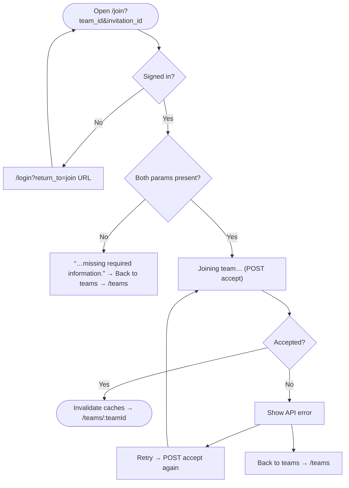
```mermaid
flowchart TD
    link(["Open /join?team_id&invitation_id"]) --> auth{Signed in?}
    auth -->|No| login["/login?return_to=join URL"] --> link
    auth -->|Yes| params{Both params present?}
    params -->|No| miss["“…missing required information.” → Back to teams → /teams"]
    params -->|Yes| join["Joining team… (POST accept)"]
    join --> ok{Accepted?}
    ok -->|Yes| team(["Invalidate caches → /teams/:teamId"])
    ok -->|No| apiErr["Show API error"]
    apiErr --> retry["Retry → POST accept again"] --> join
    apiErr --> backTeams["Back to teams → /teams"]
```

---

## B. Teams

### B1. Create a team (always a new shared team)

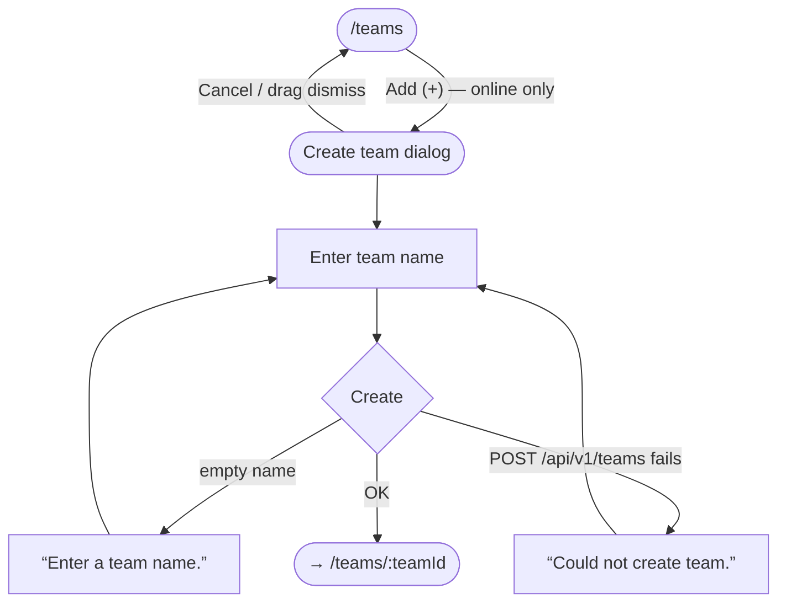
```mermaid
flowchart TD
    teams(["/teams"]) -->|"Add (+) — online only"| dlg(["Create team dialog"])
    dlg --> name["Enter team name"]
    name --> create{Create}
    create -->|empty name| e1["“Enter a team name.”"] --> name
    create -->|POST /api/v1/teams fails| e2["“Could not create team.”"] --> name
    create -->|OK| detail(["→ /teams/:teamId"])
    dlg -->|Cancel / drag dismiss| teams
```

### B2. Open a team & rename it

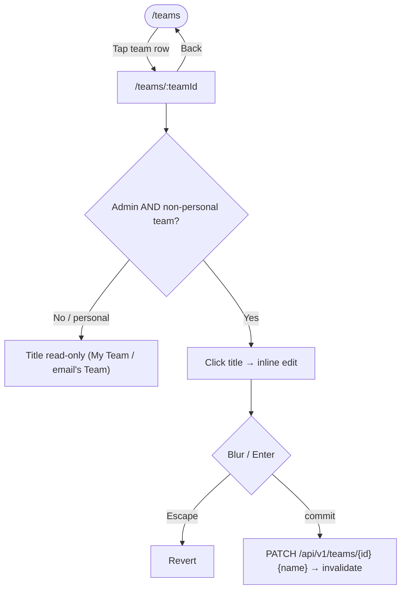
```mermaid
flowchart TD
    list(["/teams"]) -->|Tap team row| detail["/teams/:teamId"]
    detail --> who{Admin AND non-personal team?}
    who -->|No / personal| ro["Title read-only (My Team / email's Team)"]
    who -->|Yes| editTitle["Click title → inline edit"]
    editTitle --> save{Blur / Enter}
    save -->|Escape| revert["Revert"]
    save -->|commit| patch["PATCH /api/v1/teams/{id} {name} → invalidate"]
    detail -->|Back| list
```

### B3. Change member roles

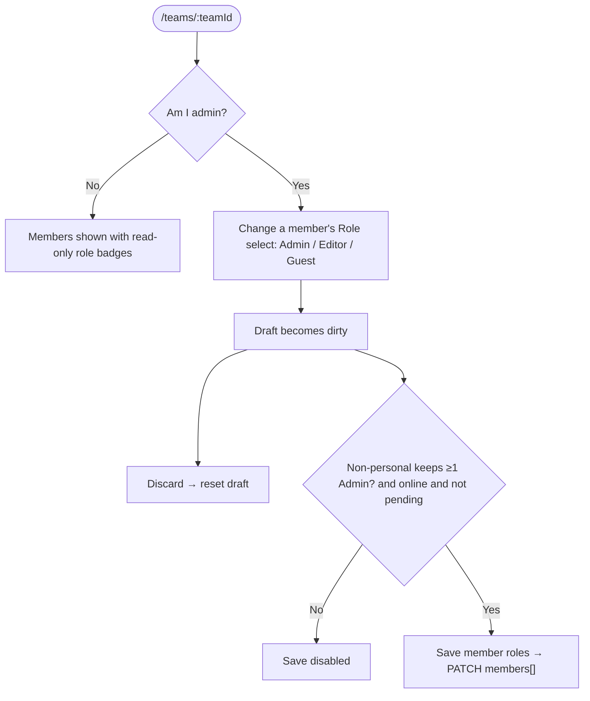
```mermaid
flowchart TD
    detail(["/teams/:teamId"]) --> admin{Am I admin?}
    admin -->|No| view["Members shown with read-only role badges"]
    admin -->|Yes| pick["Change a member's Role select: Admin / Editor / Guest"]
    pick --> dirty["Draft becomes dirty"]
    dirty --> discard["Discard → reset draft"]
    dirty --> validate{"Non-personal keeps ≥1 Admin? and online and not pending"}
    validate -->|No| disabled["Save disabled"]
    validate -->|Yes| saveRoles["Save member roles → PATCH members[]"]
```

> No UI to remove a member or leave a team; membership changes are role edits + invitations only.

### B4. Invite someone to a team

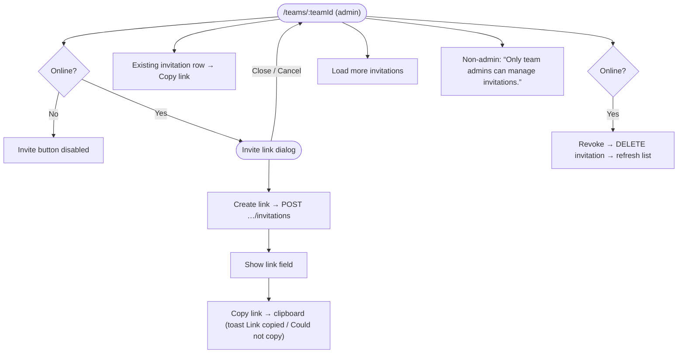
```mermaid
flowchart TD
    detail(["/teams/:teamId (admin)"]) --> invite{Online?}
    invite -->|No| dis["Invite button disabled"]
    invite -->|Yes| dlg(["Invite link dialog"])
    dlg --> createLink["Create link → POST …/invitations"]
    createLink --> show["Show link field"]
    show --> copy["Copy link → clipboard (toast Link copied / Could not copy)"]
    dlg -->|Close / Cancel| detail
    detail --> rowCopy["Existing invitation row → Copy link"]
    detail --> revoke{Online?}
    revoke -->|Yes| rv["Revoke → DELETE invitation → refresh list"]
    detail --> more["Load more invitations"]
    detail --> nonAdmin["Non-admin: “Only team admins can manage invitations.”"]
```

### B5. Delete a team

```mermaid
flowchart TD
    detail(["/teams/:teamId"]) --> gate{Admin AND non-personal?}
    gate -->|No / personal| hidden["Delete section hidden"]
    gate -->|Yes| open["Delete team → confirm dialog"]
    open --> confirm{"Delete this team?"}
    confirm -->|Cancel| detail
    confirm -->|Delete team (online)| del["DELETE /api/v1/teams/{id}"]
    del --> note["Success: stays on screen (no auto-navigate wired)"]
```

### B6. Upload and remove team cover

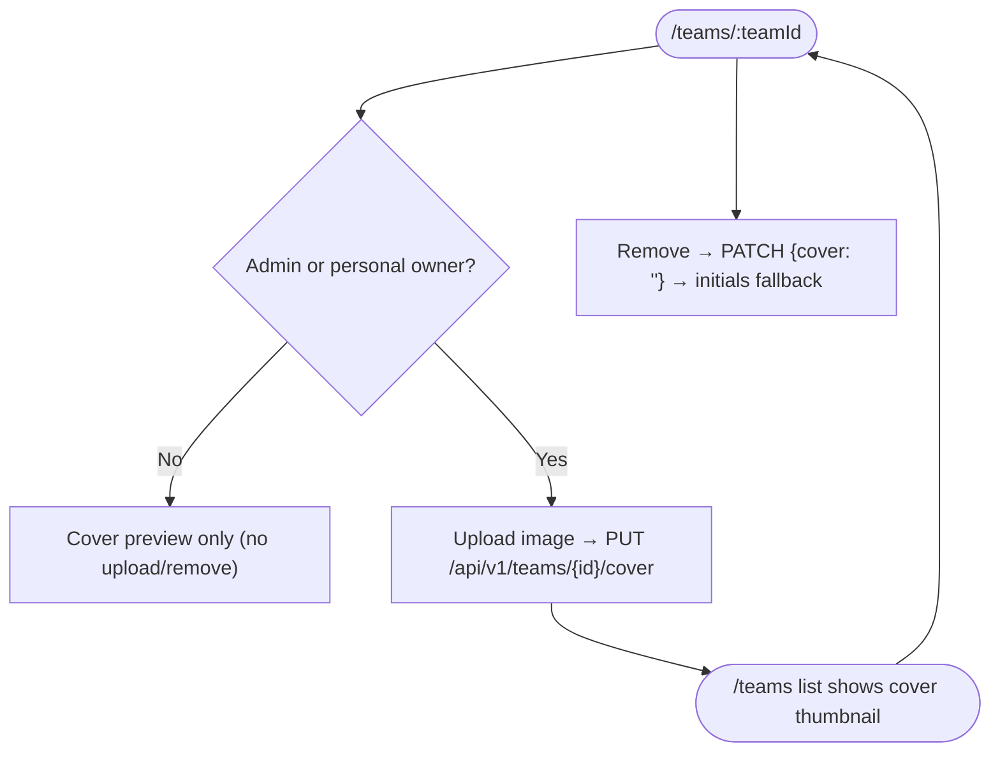
```mermaid
flowchart TD
    detail(["/teams/:teamId"]) --> gate{Admin or personal owner?}
    gate -->|No| view["Cover preview only (no upload/remove)"]
    gate -->|Yes| upload["Upload image → PUT /api/v1/teams/{id}/cover"]
    upload --> list(["/teams list shows cover thumbnail"])
    list --> detail
    detail --> remove["Remove → PATCH {cover: ''} → initials fallback"]
```

---

## C. Collections — create & manage

### C1. Create a collection for the **personal team** (0–1 writable team → no picker)

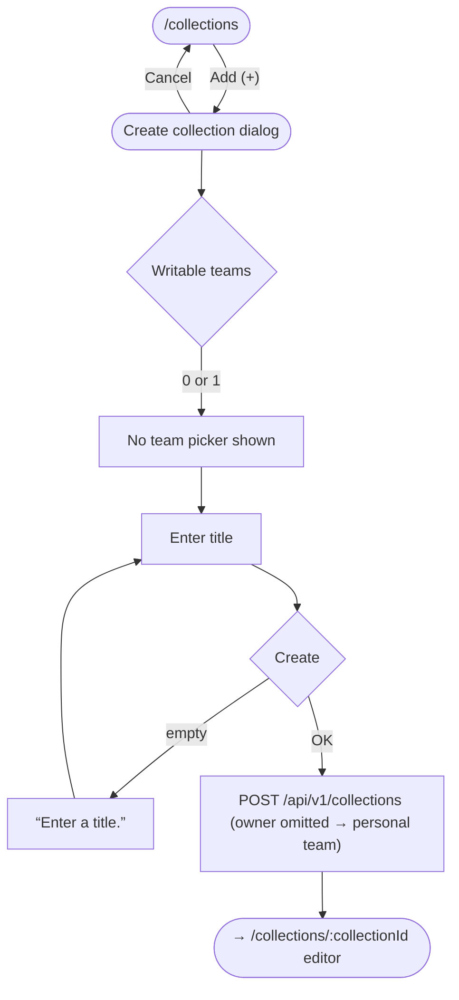
```mermaid
flowchart TD
    coll(["/collections"]) -->|"Add (+)"| dlg(["Create collection dialog"])
    dlg --> teamsCount{Writable teams}
    teamsCount -->|0 or 1| noPicker["No team picker shown"]
    noPicker --> title["Enter title"]
    title --> create{Create}
    create -->|empty| e["“Enter a title.”"] --> title
    create -->|OK| post["POST /api/v1/collections (owner omitted → personal team)"]
    post --> detail(["→ /collections/:collectionId editor"])
    dlg -->|Cancel| coll
```

### C2. Create a collection for **another team** (2+ writable teams → picker)

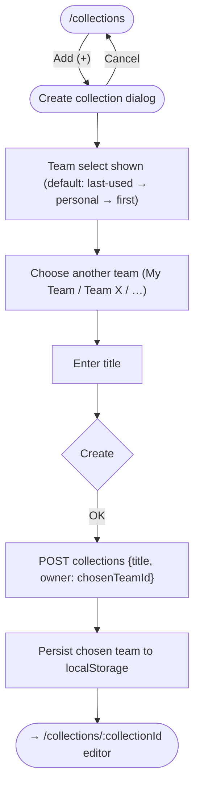
```mermaid
flowchart TD
    coll(["/collections"]) -->|"Add (+)"| dlg(["Create collection dialog"])
    dlg --> picker["Team select shown (default: last-used → personal → first)"]
    picker --> choose["Choose another team (My Team / Team X / …)"]
    choose --> title["Enter title"]
    title --> create{Create}
    create -->|OK| post["POST collections {title, owner: chosenTeamId}"]
    post --> persist["Persist chosen team to localStorage"]
    persist --> detail(["→ /collections/:collectionId editor"])
    dlg -->|Cancel| coll
```

### C3. Edit / rename a collection, manage cover & songs

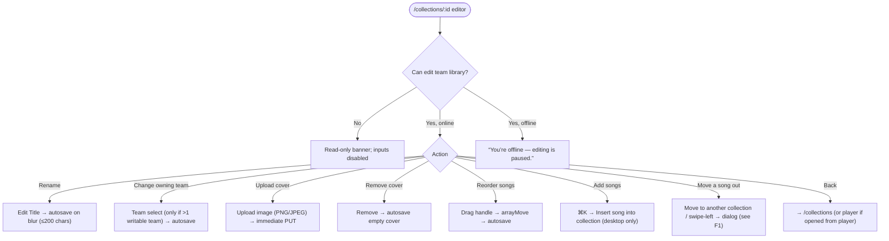
```mermaid
flowchart TD
    detail(["/collections/:id editor"]) --> canEdit{Can edit team library?}
    canEdit -->|No| ro["Read-only banner; inputs disabled"]
    canEdit -->|Yes, online| acts{Action}
    canEdit -->|Yes, offline| frozen["“You’re offline — editing is paused.”"]

    acts -->|Rename| rename["Edit Title → autosave on blur (≤200 chars)"]
    acts -->|Change owning team| team["Team select (only if >1 writable team) → autosave"]
    acts -->|Upload cover| cover["Upload image (PNG/JPEG) → immediate PUT"]
    acts -->|Remove cover| rmcover["Remove → autosave empty cover"]
    acts -->|Reorder songs| drag["Drag handle → arrayMove → autosave"]
    acts -->|Add songs| addk["⌘K → Insert song into collection (desktop only)"]
    acts -->|Move a song out| moveBtn["Move to another collection / swipe-left → dialog (see F1)"]
    acts -->|Back| back["→ /collections (or player if opened from player)"]
```

> The empty-state text says "use Add songs below" but there is **no Add-songs button** in the collection editor — songs are added only via ⌘K (desktop). There is **no remove-from-collection** action (only move/transfer).

---

## D. Songs — create, import & manage

### D1. Open the song create chooser

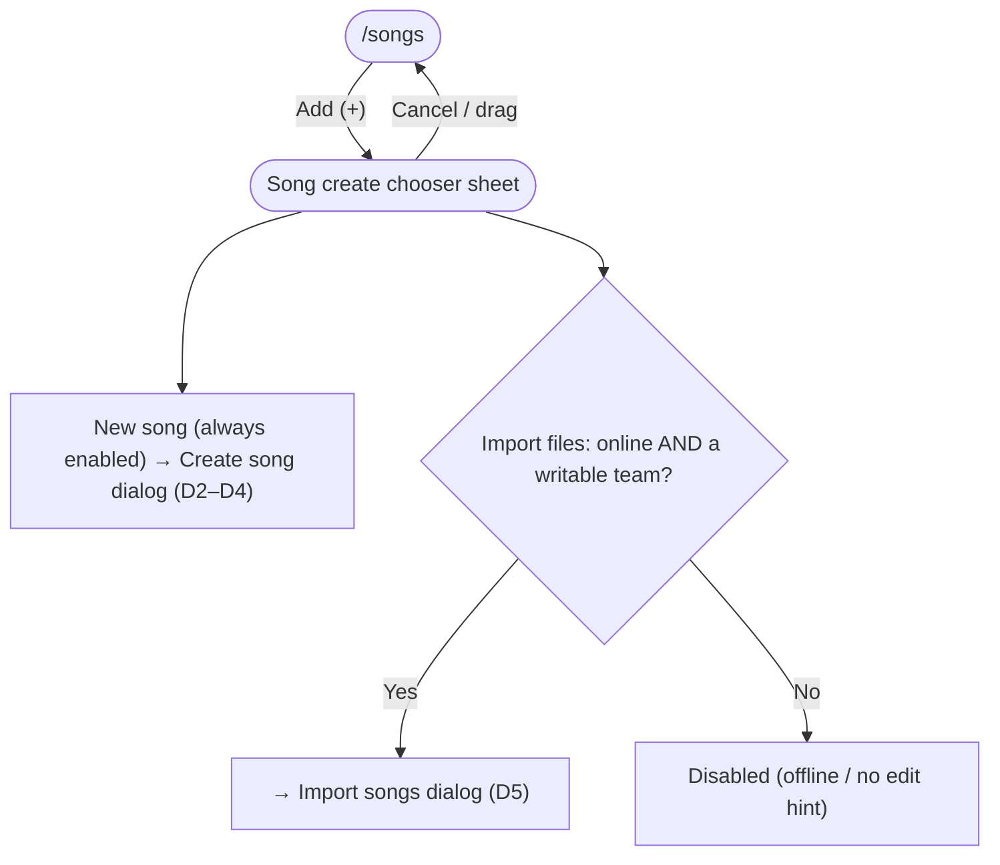
```mermaid
flowchart TD
    songs(["/songs"]) -->|"Add (+)"| sheet(["Song create chooser sheet"])
    sheet --> newSong["New song (always enabled) → Create song dialog (D2–D4)"]
    sheet --> importBtn{"Import files: online AND a writable team?"}
    importBtn -->|Yes| importDlg["→ Import songs dialog (D5)"]
    importBtn -->|No| impDisabled["Disabled (offline / no edit hint)"]
    sheet -->|Cancel / drag| songs
```

### D2. Create a song when you have exactly **one** editable collection

```mermaid
flowchart TD
    dlg(["Create song dialog — “New song”"]) --> auto["Target = that one collection (no picker)"]
    auto --> create{Create}
    create -->|POST /api/v1/songs {collection, titles:[Untitled]}| ok{OK?}
    ok -->|No| err["“Could not create song.”"] --> dlg
    ok -->|Yes| save["Write last-collection to localStorage"]
    save --> editor(["→ /songs/:songId editor"])
    dlg -->|Cancel| songs(["/songs"])
```

### D3. Create a song when you have **multiple** editable collections

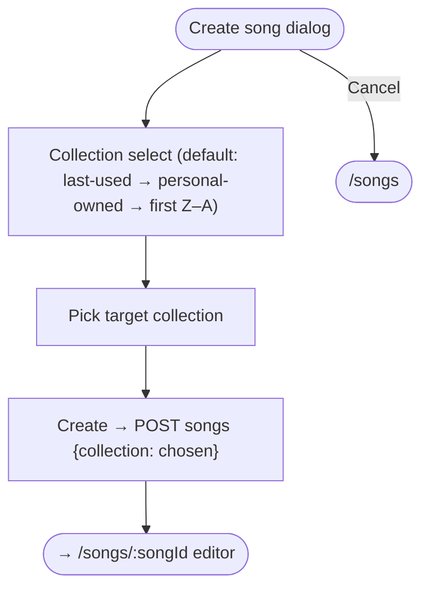
```mermaid
flowchart TD
    dlg(["Create song dialog"]) --> picker["Collection select (default: last-used → personal-owned → first Z–A)"]
    picker --> choose["Pick target collection"]
    choose --> create["Create → POST songs {collection: chosen}"]
    create --> editor(["→ /songs/:songId editor"])
    dlg -->|Cancel| songs(["/songs"])
```

### D4. Create a song when you have **no collection yet**

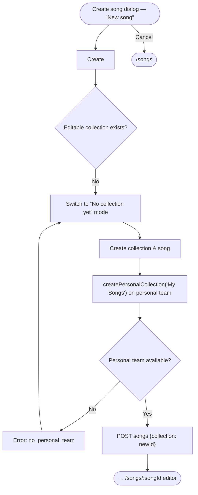
```mermaid
flowchart TD
    dlg(["Create song dialog — “New song”"]) --> create1["Create"]
    create1 --> none{Editable collection exists?}
    none -->|No| prompt["Switch to “No collection yet” mode"]
    prompt --> cc["Create collection & song"]
    cc --> mk["createPersonalCollection('My Songs') on personal team"]
    mk --> mkok{Personal team available?}
    mkok -->|No| ccerr["Error: no_personal_team"] --> prompt
    mkok -->|Yes| post["POST songs {collection: newId}"]
    post --> editor(["→ /songs/:songId editor"])
    dlg -->|Cancel| songs(["/songs"])
```

### D5. Import songs (files)

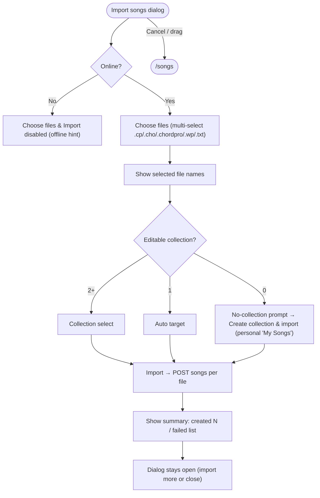
```mermaid
flowchart TD
    dlg(["Import songs dialog"]) --> online{Online?}
    online -->|No| dis["Choose files & Import disabled (offline hint)"]
    online -->|Yes| choose["Choose files (multi-select .cp/.cho/.chordpro/.wp/.txt)"]
    choose --> names["Show selected file names"]
    names --> col{Editable collection?}
    col -->|2+| pickCol["Collection select"]
    col -->|1| autoCol["Auto target"]
    col -->|0| noCol["No-collection prompt → Create collection & import (personal 'My Songs')"]
    pickCol --> imp
    autoCol --> imp
    noCol --> imp
    imp["Import → POST songs per file"]
    imp --> summary["Show summary: created N / failed list"]
    summary --> stay["Dialog stays open (import more or close)"]
    dlg -->|Cancel / drag| songs(["/songs"])
```

### D6. Add a song to a setlist (from songs list context menu)

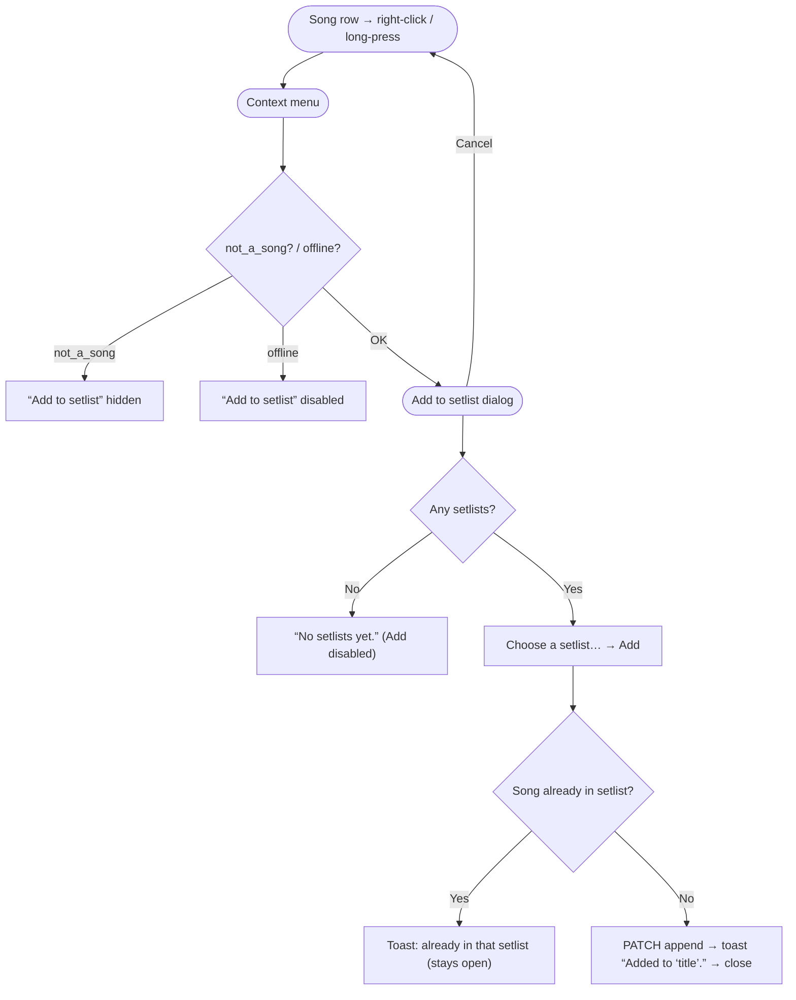
```mermaid
flowchart TD
    row(["Song row → right-click / long-press"]) --> menu(["Context menu"])
    menu --> gate{not_a_song? / offline?}
    gate -->|not_a_song| hidden["“Add to setlist” hidden"]
    gate -->|offline| disabled["“Add to setlist” disabled"]
    gate -->|OK| dlg(["Add to setlist dialog"])
    dlg --> empty{Any setlists?}
    empty -->|No| none["“No setlists yet.” (Add disabled)"]
    empty -->|Yes| choose["Choose a setlist… → Add"]
    choose --> exists{Song already in setlist?}
    exists -->|Yes| info["Toast: already in that setlist (stays open)"]
    exists -->|No| add["PATCH append → toast “Added to ‘title’.” → close"]
    dlg -->|Cancel| row
```

---

## E. Setlists — create & manage

### E1. Create a setlist for the **personal team** (0–1 writable team)

```mermaid
flowchart TD
    set(["/setlists"]) -->|"Add (+)"| dlg(["Create setlist dialog"])
    dlg --> noPicker["No team picker (0–1 writable team)"]
    noPicker --> title["Enter title (e.g. 'Easter Sunday')"]
    title --> create{Create}
    create -->|empty| e["“Enter a title.”"] --> title
    create -->|OK| post["POST /api/v1/setlists (owner omitted → personal team)"]
    post --> detail(["→ /setlists/:setlistId editor"])
    dlg -->|Cancel| set
```

### E2. Create a setlist for **another team** (2+ writable teams)

```mermaid
flowchart TD
    set(["/setlists"]) -->|"Add (+)"| dlg(["Create setlist dialog"])
    dlg --> picker["Team select (default last-used → personal → first)"]
    picker --> choose["Choose another team"]
    choose --> title["Enter title"]
    title --> create["Create → POST setlists {title, owner: chosenTeamId}"]
    create --> persist["Persist chosen team to localStorage"]
    persist --> detail(["→ /setlists/:setlistId editor"])
    dlg -->|Cancel| set
```

### E3. Add songs to a setlist (picker sheet)

```mermaid
flowchart TD
    detail(["/setlists/:id editor"]) --> btn{"Add songs (enabled: online, not saving, no save failure)"}
    btn --> sheet(["Song picker sheet — “Add a song”"])
    sheet --> search["Search songs… (excludes not_a_song)"]
    search --> pick["Tap a song row"]
    pick --> append["Append to setlist with song's default key"]
    append --> close["Close sheet, clear search"]
    sheet -->|saving in flight| wait["Rows disabled: “Wait for save to finish”"]
    sheet -->|Cancel / drag / overlay| detail
```

### E4. Add songs to a setlist (command palette, desktop)

```mermaid
flowchart TD
    detail(["/setlists/:id editor (pointer:fine)"]) -->|"⌘K"| pal(["Command palette"])
    pal --> grp["“Insert song into setlist” group"]
    grp --> ins{Patch in flight?}
    ins -->|Yes| dis["Item disabled"]
    ins -->|No| add["Insert song (duplicate badge if already present) → autosave"]
```

### E5. Change a song's key in a setlist

```mermaid
flowchart TD
    row(["Song row in setlist editor"]) --> chip["Key: {symbol} chip"]
    chip --> pop(["Key picker popover"])
    pop --> keys["Pick one of 12 keys (C, Db, D, …, B)"]
    keys --> set["Set explicit slot key → autosave"]
    note["No 'reset to original' option — always explicit"]
```

### E6. Reorder / remove a song; rename; play

```mermaid
flowchart TD
    detail(["/setlists/:id editor"]) --> act{Action}
    act -->|Rename| title["Edit Title → autosave"]
    act -->|Reorder| drag["Drag handle → autosave (announces 'Moved')"]
    act -->|Remove desktop| trash["Trash icon (no confirm)"]
    act -->|Remove mobile| swipe["Swipe-left ≥72px"]
    trash --> undo["Toast 'Slot removed.' + Undo (5s)"]
    swipe --> undo
    act -->|Play| play{"Enabled: not empty, no broken rows, not saving"}
    play -->|Yes| flush["Flush → /player (default mode)"]
    play -->|No| pdis["Play disabled ('Add songs before playing')"]
    act -->|Back| back["→ /setlists (or player return)"]
```

---

## F. Moving / adding songs between containers

### F1. Move a song from one collection to another

```mermaid
flowchart TD
    editor(["/collections/:source editor"]) --> trigger{Trigger}
    trigger -->|Desktop| btn["“Move to another collection” icon"]
    trigger -->|Mobile| swipe["Swipe-left ≥72px on row"]
    btn --> flush{flushBeforeMove OK?}
    swipe --> flush
    flush -->|No| ferr["Toast: 'Finish saving or fix unavailable songs…'"]
    flush -->|Yes| dlg(["Move song dialog"])
    dlg --> list{Other collections exist?}
    list -->|No| none["“No other collections to move this song into.”"]
    list -->|Yes| target["Choose target collection → Move"]
    target --> api["POST collections/{source}/songs/{id}/transfer {target}"]
    api --> res{Result}
    res -->|Success| ok["Toast 'Moved to ‘X’.' → remove from source → close"]
    res -->|409 already there| dup["Info: 'already in the selected collection.'"]
    res -->|404 gone| gone["'This song isn't on the server anymore…'"]
    res -->|Other| oerr["'Could not move this song.'"]
    dlg -->|Cancel| editor
```

> Moving is a **transfer**: the song leaves the source collection on success. To put the same song in multiple collections, add it again from the target — collections allow duplicates with an "Already in collection ×N" badge.

### F2. Add a song to a collection (vs. a setlist)

```mermaid
flowchart TD
    goal{Where to add a song?}
    goal -->|Into a collection| col["Open collection editor → ⌘K → Insert song into collection (desktop only)"]
    goal -->|Into a setlist| setl["Open setlist editor → Add songs sheet OR ⌘K (see E3/E4)<br/>OR Songs list → context menu → Add to setlist (see D6)"]
```

---

## G. Editors

### G1. Edit a song (Meta / Source / Preview tabs)

```mermaid
flowchart TD
    open(["/songs/:id editor"]) --> gates{Blocking state?}
    gates -->|not_a_song| ro1["Read-only: marked not a song"]
    gates -->|no edit access| ro2["Read-only: no team access"]
    gates -->|offline| ro3["Editing paused (offline)"]
    gates -->|engine loading/failed| eng["Loading chord engine… / Retry"]
    gates -->|editable| tabs{Tab}

    tabs -->|Meta| meta["Edit Title/Subtitle/Artists/Copyright/Languages/Tempo (blur),<br/>Time signature (None/4-4/6-8), Default key (None/12),<br/>Add/edit/remove custom tags"]
    tabs -->|Source| src["Edit ChordPro (CodeMirror): sections, lyrics, chords,<br/>title2..9, blob refs; live parse"]
    tabs -->|Preview| prev["Rendered A4 sheet (read-only) / parse-error notice / Retry"]

    src --> parse{Parses cleanly?}
    parse -->|No| block["'Fix ChordPro errors before saving' (autosave paused)"]
    parse -->|Yes| autos["Debounced autosave (3s)"]
    src --> ug["Paste Ultimate Guitar HTML → auto-import attempt"]
    autos --> status["Status: Saving… / All changes saved / Save failed (Retry / Discard)"]
```

> Alternate titles and image/blob attachments are only editable via the **Source** ChordPro text. `SongEditorActionsMenu` (Play / Import / Export / Print) exists in code but is **not wired** into the live editor.

### G2. Editor offline / save-failure recovery

```mermaid
flowchart TD
    edit(["Editing (song / collection / setlist)"]) --> ev{Event}
    ev -->|Save failed| fail["Banner: Retry / Discard"]
    fail -->|Retry| resend["Re-send PATCH"]
    fail -->|Discard| revert["Revert to server baseline"]
    ev -->|Went offline then back| resume["Banner: Resume syncing?"]
    resume -->|Retry sync| flush["flushNow()"]
    resume -->|Discard and reload| reload["Refetch from server, reset editor"]
    ev -->|Broken/unavailable rows (coll/setlist)| broken["Autosave paused → Discard unsaved edits"]
```

---

## H. Player — Normal mode

### H1. Open the player & navigate items

```mermaid
flowchart TD
    entry{Open from}
    entry -->|List row tap| def["mode = stored default (Normal/AV)"]
    entry -->|Context: Play in Normal mode| n["mode=normal"]
    entry -->|Editor: Play (setlist)| n
    def --> book["/player Normal (PlayerBook)"]
    n --> book
    book --> nav{Navigate}
    nav -->|Right zone / swipe-left / →/Space/Enter/j / PageDown| next["Next item (URL index synced)"]
    nav -->|Left zone / swipe-right / ←/Backspace/k / PageUp| prev["Previous item"]
    nav -->|Home / End| ends["First / last item"]
    nav -->|Book scroll mode| spread["Prev/next move two items (spread)"]
    nav -->|Escape| back["Back to source list"]
    book --> evict["If setlist evicted: 'Reconnect to continue' (nav blocked)"]
```

### H2. Show chrome, jump via TOC, filter contents

```mermaid
flowchart TD
    book(["/player Normal"]) -->|"Center tap / m"| chrome(["Chrome header + TOC sidebar"])
    chrome --> header["Header: Back, Title, '3 / 12', Transpose, Edit, Settings"]
    chrome --> toc["TOC sidebar: 'Contents'"]
    toc --> sort["Sort: Order / A–Z / Liked (syncs ?toc)"]
    toc --> lang["Filter by language (syncs ?tocLang)"]
    toc --> tag["Filter by tag (syncs ?tocTags)"]
    toc --> jump["Tap entry → jump to item"]
    toc --> emptyL["Liked empty: 'No liked songs in this list.'"]
    toc --> emptyF["Filtered empty: 'No songs match the selected filters.'"]
    chrome -->|center tap / m / edge tap| hide["Hide chrome"]
```

### H3. Transpose the current song

```mermaid
flowchart TD
    book(["chords item"]) --> how{How}
    how -->|Chrome → Transpose button| pop(["Transpose popover"])
    pop --> def["Default → clear override"]
    pop --> key["Pick key (C…B) → set override"]
    how -->|Keys A–G| setroot["Set transpose to that root"]
    how -->|r| reset["Reset to default"]
    how -->|b or -| down["Down one semitone"]
    how -->|# or +| up["Up one semitone"]
    note["Transpose is per-item, persisted locally (not in URL)"]
```

### H4. Other normal-mode controls (keyboard)

```mermaid
flowchart TD
    book(["/player Normal"]) --> k{Key / gesture}
    k -->|s| scroll["Cycle scroll mode: Sheet → Book → 2-col → 2-col+next → 3-col → 3-col+next"]
    k -->|n| fmt["Toggle chord format (Letters ↔ Nashville)"]
    k -->|l or double-tap center| like["Toggle like (online, chords item) + heart burst"]
    k -->|e| edit["Edit song → /songs/:id (return context)"]
    k -->|chrome Edit setlist/collection| editc["→ setlist/collection editor"]
    k -->|chrome Settings gear| settings["→ /settings?tab=player (return context)"]
```

---

## I. Player — AV mode & projection

### I1. AV navigation (slides vs items)

```mermaid
flowchart TD
    av(["/player?mode=av (PlayerAv) — header & TOC always visible"]) --> k{Key / control}
    k -->|→/Space/Enter/j / PageDown| nslide["Next slide (within item)"]
    k -->|←/Backspace/k / PageUp| pslide["Previous slide"]
    k -->|Home / End| ends["First / last slide"]
    k -->|n| nitem["Next item (slide → 0)"]
    k -->|Shift+N| pitem["Previous item"]
    k -->|TOC entry| jumpItem["Go to item (session only)"]
    k -->|Slides panel card| jumpSlide["Go to slide → updates projected + sets live"]
    k -->|Outline row| jumpSlide
    k -->|Escape| back["Back to source list"]
```

### I2. AV live screen states & background

```mermaid
flowchart TD
    av(["/player AV"]) --> state{Control}
    state -->|"r / 'Blank' button"| blank["Toggle Blank (background only, no text)"]
    state -->|"Shift+R / 'Blackout' button"| black["Toggle Blackout (solid black)"]
    state -->|Section shortcut key c/v/p/1-9/b/t/e| sect["Jump to that section's first slide"]
    state -->|Background selector| bg["Expand → pick Black / Red / Ray"]
    blank --> sync["Broadcast to output window"]
    black --> sync
    bg --> sync
    jump["Slide navigation"] --> sync
```

### I3. Open & drive the projection output window

```mermaid
flowchart TD
    av(["/player AV"]) -->|"Open output (O)"| open["window.open('/player/output?s=sessionId', 'wv-av-output')"]
    open --> out(["Projection output window"])
    out --> render["Renders projected slide: Live (bg+text) / Blank (bg only) / Blackout (black)"]
    av -. "BroadcastChannel + localStorage snapshot" .-> render
    out --> fs{"Double-click"}
    fs -->|'Allow fullscreen' setting on| full["Enter fullscreen"]
    fs -->|off| nofull["No-op"]
    out --> missing["No ?s param → 'Missing projection session.'"]
    av -->|AV settings gear| settings["→ /settings?tab=playerRoles (return context)"]
```

---

## J. Settings & preferences

### J1. General tab

```mermaid
flowchart TD
    g(["Settings → General"]) --> opt{Preference}
    opt -->|Language| lang["Use browser default / English / German → apply i18n"]
    opt -->|Appearance| appr["Use browser default / Light / Dark → apply theme"]
    opt -->|Collections layout| lay["Cards / List / Adaptive"]
    opt -->|Default player mode| mode["Normal mode / AV mode (used by row tap)"]
    opt -->|Profile picture| pic["Upload new photo / Remove uploaded photo"]
    opt -->|Cache| cache["Clear local cache (keeps language/appearance)"]
    g --> account{Account}
    account -->|Teams| t["→ /teams"]
    account -->|Sessions| s["→ /sessions"]
    account -->|Log out| lo["performLogout → /login"]
    g -->|Back| back["Back to library (/collections) or player return"]
```

### J2. Player Default tab

```mermaid
flowchart TD
    p(["Settings → Player Default"]) --> opt{Preference}
    opt -->|Chord format| cf["Letters / Nashville"]
    opt -->|Sheet background| sb["White / App background"]
    sb --> inv["Checkbox: Invert images (app background only)"]
    opt -->|Scroll mode portrait| sp["Sheet / Book / 2-col / 2-col+next / 3-col / 3-col+next"]
    opt -->|Scroll mode landscape| sl["(same 6 options)"]
```

### J3. Player AV tab

```mermaid
flowchart TD
    a(["Settings → Player AV"]) --> opt{Preference}
    opt -->|Content layer| cl["Lines per slide (1–10), Balance lines (checkbox), Font size (20–120)"]
    opt -->|Text alignment| al["Left / Center / Right"]
    opt -->|Vertical position| vp["Top / Center / Bottom"]
    opt -->|Text shadow| sh["None / Subtle / Medium / Strong"]
    opt -->|Text transform| tt["None / Uppercase / Lowercase / Capitalize"]
    opt -->|Lyrics spacing| ls["Use single spaces between words (checkbox)"]
    opt -->|Background| bg["Black / Red / Ray"]
    opt -->|Slide transition| tr["None / Fade / Slide"]
    opt -->|Transition duration| dur["0–2000 ms slider"]
    opt -->|Output fullscreen| of["Allow fullscreen / No fullscreen shortcut"]
```

---

## K. Sessions

### K1. View & revoke sessions

```mermaid
flowchart TD
    s(["/sessions"]) --> list["Active sessions list (paginated)"]
    list --> current["Current device badged 'This device' (when identifiable)"]
    list --> unknown["Else: 'current browser can't be highlighted…'"]
    list --> revoke{"Revoke a row (incl. current)"}
    revoke -->|offline| dis["Revoke disabled"]
    revoke -->|online| confirm["'Revoke this session?' → Cancel / Revoke session"]
    confirm --> del["DELETE …/sessions/{id} → refresh (no local logout)"]
    list --> more["Load more"]
```

> There is no "revoke all sessions" action.

---

## L. Hub lists

### L1. Browse a list (search, scroll, refresh)

```mermaid
flowchart TD
    list(["/collections | /songs | /setlists | /teams"]) --> act{Action}
    act -->|Type in search| q["Search… → 300ms debounce → server query"]
    act -->|Empty + search| clr["'No results' → Clear search"]
    act -->|Scroll to bottom| inf["Auto fetch next page"]
    act -->|Load more| lm["Manual next page"]
    act -->|Pull down (touch)| pr["Pull to refresh → Release → Refreshing…"]
    act -->|Query error| retry["'Something went wrong' → Retry"]
    act -->|Switch tab| tab["Collections/Songs/Setlists (clears search)"]
    list --> layout["Collections only: Cards / List / Adaptive (from Settings)"]
```

### L2. Open a row / open context menu

```mermaid
flowchart TD
    row(["List row/card"]) --> open{Interaction}
    open -->|Tap / Enter / Space| play["→ /player (stored default mode)"]
    open -->|Right-click| ctx(["Context menu"])
    open -->|Long-press ~500ms| ctx
    ctx --> edit["Edit → editor route"]
    ctx --> pn["Play in Normal mode"]
    ctx --> pav["Play in AV mode"]
    ctx --> dup["Duplicate (collections/setlists; online)"]
    ctx --> add["Add to setlist (songs, not not_a_song; online)"]
    ctx --> exp["Export ▸ ChordPro / Worship Pro / PDF (print)"]
    ctx --> del["Delete (online)"]
```

### L3. Duplicate a collection / setlist

```mermaid
flowchart TD
    ctx(["Context menu → Duplicate"]) --> on{Online?}
    on -->|No| dis["Disabled"]
    on -->|Yes| run["Toast 'Preparing export…' → build copy"]
    run --> ok{Success?}
    ok -->|Yes| made["Toast 'Created “X (copy)”.' → invalidate → open new editor"]
    ok -->|No| err["'Could not duplicate this …'"]
```

### L4. Export a song / collection / setlist

```mermaid
flowchart TD
    ctx(["Context menu → Export ▸"]) --> fmt{Format}
    fmt -->|ChordPro| cp["Song: .cp download · Collection/Setlist: ZIP of numbered .cp"]
    fmt -->|Worship Pro| wp["Song: .wp · Collection/Setlist: ZIP of .wp"]
    fmt -->|PDF (print)| pdf["Render A4 HTML in hidden iframe → browser print dialog (Save as PDF)"]
    cp --> uses["Uses current Chord format preference; skips not_a_song slots"]
    wp --> uses
    pdf --> uses
    note["Errors: 'Could not export this song/collection/setlist.'"]
```

### L5. Delete an item (with collection-not-empty guard)

```mermaid
flowchart TD
    ctx(["Context menu → Delete (online)"]) --> kind{Entity}
    kind -->|Collection with songs| blocked["Dialog: '…still contains songs. Delete every song first' (Cancel only)"]
    kind -->|Empty collection / song / setlist| confirm["'Delete this item?' → Cancel / Delete"]
    confirm --> api["DELETE → close → invalidate list"]
    api --> srv409{"Server 409 (collection not empty)?"}
    srv409 -->|Yes| t409["Toast: 'Remove all songs from the collection before deleting it.'"]
    srv409 -->|No| done["Removed from list"]
```

---

> Cross-cutting notes: the command palette and ⌘K-based "insert song" exist only on `pointer:fine` devices. The collection editor has no Add-songs button (⌘K only) and no remove-song action (move/transfer only). `SongEditorActionsMenu` is dead code. Successful **Delete team** does not auto-navigate (no `onRequestClose` wired). Import, Duplicate, Delete, Add-to-setlist, and the Add (+) FAB are all online-only.
