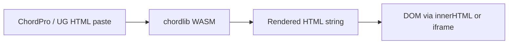

# Offline, export, and import security model

Trust boundaries for user-supplied chord content, cached data, and export paths. User-facing hardening (CSP, sanitization) is tracked separately as action plan **5.1**.

## Content trust boundary

| Stage | Location | Trust assumption |
|-------|----------|------------------|
| Parse / format | [`chord-engine-wasm.ts`](../../frontend/app/src/adapters/chord-engine-wasm.ts) → external `chordlib` | User content is **untrusted**; WASM output is HTML |
| Player slides | `ChordsSlide.tsx`, `ChordsThreeColumnSlide.tsx` | `dangerouslySetInnerHTML` |
| Editor preview | `SongEditorPreview.tsx` | Same |
| PDF / print | [`song-import-export.ts`](../../frontend/app/src/lib/song-import-export.ts) — hidden iframe | Isolated document; no app theme CSS |

**Current gap:** No Content-Security-Policy on the SPA shell; chord HTML is not sanitized after WASM render (**5.1**). Ultimate Guitar HTML import is capped at **2 MB** client-side before WASM parse.

## Offline cache (Dexie)

| Store | Purpose | Code |
|-------|---------|------|
| Player mirror | Song bodies + metadata for opened player items | [`player-mirror-cache.ts`](../../frontend/app/src/lib/offline/player-mirror-cache.ts) |
| Blob prefetch | Cover/avatar bytes for offline display | [`blob-prefetch-cache.ts`](../../frontend/app/src/lib/offline/blob-prefetch-cache.ts) |

- Mirror writes run after navigation (not blocking first paint).
- **Logout / 401:** [`clearAllLocalData`](../../frontend/app/src/lib/clear-local.ts) wipes TanStack Query + Dexie; **locale keys are preserved** (`i18nextLng`, `wv_use_browser_locale`).

## Export policy

| Export type | Offline | Notes |
|-------------|---------|-------|
| Single song (ChordPro / PDF) | **Yes** if song body in mirror | PDF uses local WASM render + print iframe |
| Collection / setlist bundle | **No** — requires network | [`run-collection-export.ts`](../../frontend/app/src/lib/run-collection-export.ts), [`run-setlist-export.ts`](../../frontend/app/src/lib/run-setlist-export.ts) hydrate song links from API |
| Collection/setlist ZIP | **No** | Same hydration path |

UI should disable or warn when offline (action plan **1.32** — user-facing).

## Import policy

- **Online required** for execute path that POSTs new songs (`ImportSongsDialog`, batch create).
- Parsed content never sent to server as raw HTML — only ChordPro JSON **`data`** field.

## Blob URLs

- Object URLs created for prefetched blob bytes; revoked when cache evicts or on logout wipe.
- Team/collection covers reference **`record<blob>`** ids; fetches go through authenticated `/blobs/{id}`.

## HTTP security headers (backend)

Production static + API responses should eventually include CSP, `X-Content-Type-Options`, and `frame-ancestors` (**5.1**). Document any header additions here when implemented.

## Related docs

- [`frontend-user-flows.md`](frontend-user-flows.md) — offline editing gates (**G1**, **G2**)
- [`search-contract.md`](search-contract.md) — hub list behavior offline
- [`../licensing/non-standard-crates.md`](../licensing/non-standard-crates.md) — `chordlib` dependency
