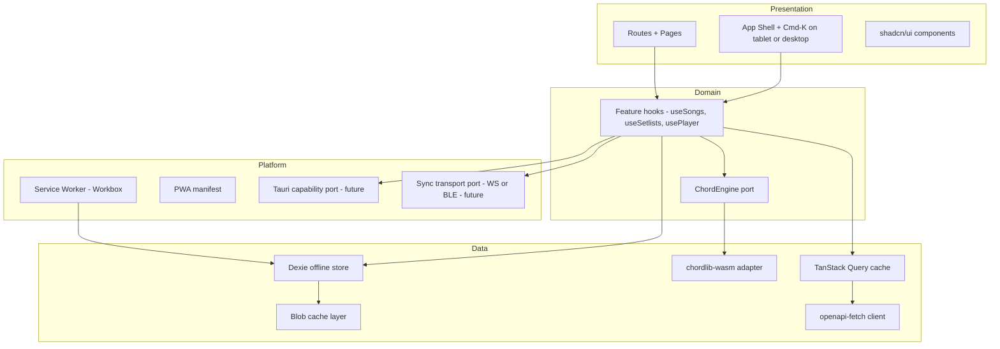

# Architecture

Layered SPA: presentation → domain hooks → data (API + offline) → platform (PWA, future Tauri/sync).

## Layer diagram



## Layering rules

1. **Pages** depend on **feature hooks** only (not raw `fetch` / `openapi-fetch`).
2. **Feature hooks** call **`services/*`** modules that own the typed client, optimistic updates, and Dexie read-through/write-through where needed.
3. **Ports** (`src/ports/*`): `ChordEngine`, `SyncTransport`, `PlatformCapabilities` — interfaces only.
4. **Adapters** (`src/adapters/web/*`, future `src/adapters/tauri/*`): implement ports for each shell.
5. **WASM** loads **lazily** behind `ChordEngine` so the main bundle stays small and SSR/edge options stay open.

## Ports (summary)

| Port | Responsibility |
|------|----------------|
| `ChordEngine` | Parse ChordPro/WorshipPro, transpose, render DIN-A4 HTML — backed by chordlib WASM on web. |
| `SyncTransport` | `connect()`, `broadcast(event)`, `onEvent(cb)` — WebSocket first; BLE later in Tauri. |
| `PlatformCapabilities` | `install()`, `share()`, `openExternal()`, optional `fsBlobCache()` — web vs native. |

## Offline strategy (MVP)

**Requirement (MVP):** **Setlist** player payloads (+ blobs) cacheable for emergency playback without network. **Song** and **collection** players are **online-only** in MVP (no Dexie mirror / no offline emergency playback). Editing stays online-only until a later phase.

### Consistency (decided)

- **Online:** The **remote** `GET .../player` response is authoritative. **Dexie** is a **fallback cache for offline use only** and is **updated on every successful fetch** from the network (mirror after success).
- **Online + network/request failure:** Do **not** fall back to Dexie for display or playback. Show the normal **online error** path and retry; stale local copies are not a substitute while the app considers itself online.
- **Offline:** Read **setlist** player payloads and blob bytes from Dexie per cached policy; no network. **Song/collection** players require network in MVP.
- **Connectivity UI:** Drive online/offline state from **browser `online` / `offline` events immediately** (no debounce in MVP).
- **HTTP caching:** For the app’s offline mirror, **do not** let API `Cache-Control` override the rules here — Workbox/Dexie behavior follows this doc; headers are not the source of truth for emergency cache.
- **Storage quota (e.g. Safari):** Prefer **LRU eviction + user notification** when approaching limits. If persistence still fails (e.g. **`QuotaExceededError`**), show a **blocking or focused prompt** to **clear offline cache** or shrink retention — the user must choose a path; do not leave offline mode silently broken.
- **Logout / 401:** Full **local** wipe — **entire TanStack Query cache and entire Dexie database** (see [API integration](./api-integration.md)). **`POST /auth/logout`** when online; **offline logout** clears local immediately and **queues** server logout for reconnect. **401** uses the same **local** wipe and redirect to `/login` (no local session retention).
- **Multi-tab / reload:** LRU **eviction does not tear down an already-open player** session in another tab. After a **full reload**, resolve from Dexie if still present; if the entry was evicted, show the **normal “not available offline / refetch”** error flow.
- **Eviction during playback:** If the current setlist drops out of cache while playing, allow **finishing the current blob/item** (grace for the active object URL / item), then **block advancing** until the user is back online or opens content that is still cached.

### Mechanics

- **Org / team policy:** **No** per-org override of offline retention in MVP — **global LRU + byte budget** only (see [grill-session.md](./grill-session.md)).
- **Private browsing / ephemeral storage:** Treat **install / offline-heavy** features conservatively — **do not** promote PWA install if the environment cannot support durable storage; core **online** flows may still work (see [PWA install](./pwa-install.md)).
- **Workbox (MVP):** **Precache** hashed static assets (JS/CSS/fonts/shell) and **SPA navigation fallback** only — **no** Workbox runtime cache for `/api/*` or player payloads. TanStack Query + Dexie own network-fetched data; this avoids competing caches and matches the **minimal SW** rule until **E4** offline Dexie work (see [PWA install](./pwa-install.md)).
- **Aborted or partial mirror:** If a fetch aborts mid-write, offline use follows **incomplete mirror** rules. **Healing:** the **next successful online fetch** repopulates Dexie from the network (authoritative); no separate checksum layer in MVP.
- **Runtime fetch:** When online, `GET` for **setlist** `.../player` and referenced blob data uses the network; on **success**, mirror payloads + blob bytes into **Dexie**. (Song/collection player GETs are not mirrored in MVP.)
- **Eviction**: **LRU** by “last opened” for **cached setlist players** only; keep last **N** (default **5**). **“Last opened”** is updated when the user **opens the setlist player** for that id, **not** when merely opening the editor or prefetching the next item. **No user-facing “pin offline”** in MVP — retention is **automatic only** within LRU + byte budget (recent/eligible content is cached by policy without a separate pin action).
- **Stale server content:** While offline or on a stale cache hit for a **setlist**, **keep showing the cached player** until the user **opens that setlist player again** after connectivity returns, then **fetch fresh** from the network (no blocking “out of date” gate in MVP). If the server **deleted** the resource while the user still had a cache, **allow offline playback** until online — on the **next successful online fetch** that shows the resource is **gone**, **clear** the local mirror and **notify** (toast/banner). **E8 implementation:** `reconcileSetlistPlayer404` + `evictOneSetlistMirror` in [`server-deleted-reconciliation.ts`](../app/src/lib/player/server-deleted-reconciliation.ts); **`touchSetlistPlayerOpened`** bumps LRU only on player open (not editor).
- **Eviction during playback (E8):** `useSetlistEvictionWatch` polls the Dexie mirror while a setlist player is open; if the mirror is evicted in another tab, the **current item stays visible** but **Prev/Next disable** with an aria-live message until reconnect.
- **Incomplete mirror:** If mirroring stops partway, the cache is still **usable offline for what was stored**; **missing** blob/pages **error at navigate** to those items (partial OK, not poisoned whole-setlist).
- **Service worker update:** **Non-blocking toast** (“New version — Reload”); **user chooses** when to reload — **no forced reload** in MVP, even if the update notice is ignored for a long time (not limited to “during playback” only).
- **Byte budget**: The configured cap applies to **all persisted offline-playback data in Dexie** used for emergency mode (player mirrors, blob bytes, and related offline indexes/metadata for those entries), not only raw blob files.
- **Offline UX**: Compact **indicator near the avatar** (persistent until back online): “Offline — emergency mode” or equivalent; **Create (+)** disabled with explanation; other create/edit mutations disabled; **setlist** player reads Dexie when offline; **song/collection** players show the standard unavailable/network error in MVP.

```mermaid
sequenceDiagram
  participant User
  participant Player
  participant Query as TanStack Query
  participant API
  participant DB as Dexie IndexedDB
  User->>Player: Open setlist player
  Player->>Query: getSetlistPlayer(id)
  Query->>API: GET /setlists/{id}/player
  API-->>Query: Player payload
  Query-->>Player: render
  Player->>DB: upsert setlistPlayer + referenced blobs
  Note over DB: LRU last N setlists; automatic retention only
  User--xAPI: Network lost
  User->>Player: Reopen cached setlist
  Player->>DB: Read cached player + blobs
  DB-->>Player: Offline playback OK
```

## Sync-player readiness (not implemented yet)

- **Player mode layering (E8.1):** `/player?mode=normal|av` selects a **view variant** on the same payload. **AV mode** syncs projection output via **`BroadcastChannel` + `localStorage` snapshot** (`av-projection-sync.ts`) until **`SyncTransport`** (E9) replaces ad-hoc cross-window transport. Output route **`/player/output?s=`** is a read-only mirror of AV control state — not a second player domain model.
- **Player state** lives in a small Zustand store (or reducer) that emits **`PlayerEvent`**s: navigate index, scroll mode, orientation, etc.
- **`SyncTransport`** subscribes and rebroadcasts; remote events apply to the same reducer.
- **Sync iteration 1 (web):** `WebSocket` to a future `/api/v1/sync` (or room URL) — adapter `wsSyncTransport`.
- **Sync iteration 2 (Tauri):** BLE bridge — adapter `bleSyncTransport`; Web may use Web Bluetooth where supported.
- **Protocol versions:** **Handshake** required — clients **refuse or block** join when the sync **protocol / schema version** is unsupported; show an **upgrade the app** message (see [roadmap](./roadmap.md) **E9**).
- **UI:** “Paired devices” badge in player; inert until backend exists.

## Tauri readiness

- **No Node-only APIs** in app code; use `PlatformCapabilities` for OS integrations.
- **Build artifact**: static `dist/` only — Tauri loads the same files as the PWA.
- **Offline cache parity:** **IndexedDB + Dexie LRU rules on web** remain **authoritative** for what “cached” means; a future **native blob cache** adapter in Tauri must **mirror these semantics** (eviction order, budgets), not invent a second LRU policy.
- **Future**: native audio, larger offline cache on disk via Tauri FS adapter implementing blob cache port.

## Platform capability gates (illustrative)

Features that **must not** silently degrade on web when they truly require native ports (extend as the app grows):

| Area | Web | Native / Tauri later |
|------|-----|-------------------------|
| **Sync transport** | WebSocket room sync when backend exists | BLE / system integrations via `bleSyncTransport` |
| **Deep OS** share, files | `navigator.share` where available | Full `PlatformCapabilities` surface |
| **Sheet display** | **Preserve** original pixel colors for scans — **no** CSS color inversion of blob content (dark mode still applies to **chrome**). |

## chordlib → WASM

- **Crate**: `crates/chordlib-wasm` depends on `chordlib` + `wasm-bindgen`.
- **Expose** (illustrative; align with actual `chordlib` API): `parse`, `toChordPro`, `toWorshipPro`, `transpose`, `renderA4Html`.
- **Build**: `wasm-pack build --target web --out-dir ../../packages/chordlib-wasm/pkg`
- **App**: Dynamic `import()` of `@worshipviewer/chordlib-wasm` inside `ChordEngine` adapter.

## Related docs

- [Tech stack](./tech-stack.md)
- [PWA install](./pwa-install.md)
- [API integration](./api-integration.md)
- [Roadmap](./roadmap.md)
- [Design grill session](./grill-session.md)
