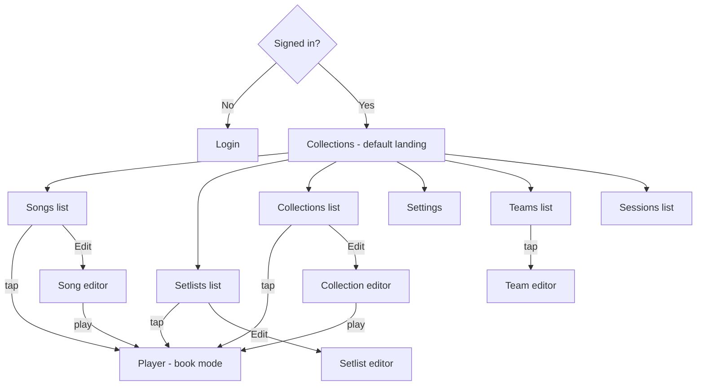

# Pages and flows

## Route table

**E1 vs E2:** **E1** used a **minimal stub** at **`/`**; **E2** ships the **three hub lists** and **`/` → `/collections`** for signed-in users (see [roadmap E2](./roadmap.md#e2--three-hub-lists-collections-songs-setlists)).

| Route | Page | Notes |
|-------|------|--------|
| `/login` | Login | **OAuth** and **email OTP** with **equal prominence** (tabs or segmented control). **Marketing copy + footer legal links** — [branding.md](./branding.md). See [E1 interactive grill](./grill-session.md#e1-interactive-grill--user-session-resolved). |
| `/` | Redirect | → `/collections` when authenticated ([epic E2](./epic-e2-action-plan.md)). |
| `/collections` | Collections list | Default **card** view (A4 cover aspect). **Primary tap / Enter / Space** → **`/player`** (`type=collection`) in the **global default player mode** (E8.1). **FAB +** → **`CreateCollectionDialog`** (`?new=1` latch); success → **`/collections/:id`**. **Edit** via long-press / context menu. Context menu includes **Play in Normal mode** and **Play in AV mode**. Long-press **Export** → ChordPro / Worship Pro (`.zip` of `.cp` / `.wp`) or **PDF (print)** ([E6](./epic-e6-action-plan.md)). |
| `/songs` | Songs list | Default **list** view. Primary tap opens `/player` in the **global default player mode**. Context menu includes **Play in Normal mode** and **Play in AV mode**. **FAB +** → chooser **New song** \| **Import files** ([E6](./epic-e6-action-plan.md)). Long-press **Export** (ChordPro / Worship Pro / PDF). |
| `/setlists` | Setlists list | Default **list** view. Primary tap opens `/player` in the **global default player mode**. Context menu includes **Play in Normal mode** and **Play in AV mode**. **FAB +** opens **create setlist** when the team library is writable; after create, navigate to **`/setlists/:id`**. Long-press **Export** → ChordPro / Worship Pro (`.zip`) or **PDF (print)** ([E6](./epic-e6-action-plan.md)). |
| `/collections/:id` | Collection editor | **[E7.2](./epic-e7.2-action-plan.md)** — parity with **`/setlists/:id`**: picker, Cmd-K, reorder, **`SongLink.nr`**, slot keys (**[setlist-editor](./setlist-editor.md)**). **Play** in editor (flush-before-Play). **`/collections/:id`** is **not** allowlisted for **`return_to`** (logged-out bounce → **`/collections`**). |
| `/songs/:id` | Song editor | ChordPro/WorshipPro via chordlib; **Import / Export** overflow menu ([E6](./epic-e6-action-plan.md)); **Play** in editor chrome (flush + parse gate). See [Song editor](./song-editor.md). |
| `/setlists/:id` | Setlist editor | Autosave: reorder, slot keys, add/remove songs ([setlist-editor.md](./setlist-editor.md)). **Play** in editor (flush-before-Play) or from hub / context menu. |
| `/player` | Player | **Book mode** at **`/player?type=&id=`** (song, setlist, or collection). **No app shell** — dedicated player chrome: **TOC drawer**, **scroll modes** (`scroll_type`), **orientation**, **transpose** (chords), **online/offline indicator**. View state (scroll, orientation, transpose, chord format) persists in **`localStorage`** per resource (`playerView:{type}:{id}`). Blob items use **`useBlobUrl`** (Dexie cache + network; PDF via native `<embed>`, no pdf.js). **Prefetch next item** when online. See [App shell](./app-shell.md). |
| `/settings` | Settings | **Language**, **appearance** (light / dark / system), cache, account shortcuts, and a dedicated **Player roles / AV** tab (E8.1) with deep-link support for in-player quick access. |
| `/teams` | Teams list | Tap → team editor. |
| `/teams/:id` | Team editor | Members, invitations. |
| `/sessions` | Sessions list | Current user’s sessions; revoke/delete. |

All routes are **deep-linkable** and must work after PWA standalone reload (client-side router + `index.html` fallback). **`/login` + `return_to`:** only **same-origin** app paths are allowed — **restore full path + query** after successful auth (no open redirects). Host production SPA at **`/`** (see [plan.md](./plan.md#decision-log)).

## Settings (`/settings`)

- **Language:** User picks a **concrete locale** (every shipped language the app supports) **or** **Use browser default**. **MVP ships English and German only**; additional locales are out of scope until a later release (i18next wiring can add more without structural change). When browser default is selected, resolve the active locale from the browser’s language list (for example `navigator.languages`) and map it to the nearest **supported** app locale. If the browser preference does **not** match any shipped locale, **fall back to English** for UI strings.
- **Appearance:** User picks **Light**, **Dark**, or **Use browser default** (follow `prefers-color-scheme` so the theme tracks OS / browser light–dark mode until the user chooses an explicit override).
- **Player roles / AV (E8.1):** Dedicated settings tab for role-variant player defaults. Includes at least: default player mode selector (Normal/AV), content typography controls, background controls (color/gradient/image/video + brightness), transition controls, and projection behavior controls. The player exposes a quick-access action that opens this tab directly via deep-link.

## Auth gate

```mermaid
flowchart TB
  Start[App load]
  Check{Session valid?}
  Me[GET /users/me]
  Login[/login]
  App[Main shell + tabs]
  Start --> Check
  Check -->|unknown| Me
  Me -->|200| App
  Me -->|401| Login
  Check -->|no cookie| Login
```

- After OTP verify or OAuth callback, hydrate TanStack Query with `/users/me` and navigate to `/` or **`return_to`** (allowlisted same-origin path, **including query string**). Surface API **`Problem`** bodies **inline** on the OTP screen when login is throttled or rejected; generic fallback copy if the body is empty.

## High-level navigation



Hub lists (**collections / songs / setlists**) use **primary tap** → **`/player`** (`type` + `id`) in the global default player mode. Context menus expose explicit **Play in Normal mode** and **Play in AV mode** entries. All three **editors** include **Play** with **flush-before-Play** ([setlist-editor.md](./setlist-editor.md), [song-editor.md](./song-editor.md)).

## List → editor → player

1. **List**: User scrolls; **infinite query** with **Load more** (see [API integration](./api-integration.md)). **Primary tap** on **collections / songs / setlists** → **`/player`** in the global default mode. **Long-press** (~500 ms) or **right-click** → actions (**Edit**, **Delete**, **Play in Normal mode**, **Play in AV mode**, Duplicate where applicable). **Editors** (`/collections/:id`, `/songs/:id`, `/setlists/:id`) are reached from **long-press Edit**, deep links, or **Create** — **not** from primary tap on hub rows (tap opens **`/player`**). **Pull-to-refresh** on `/collections`, `/songs`, and `/setlists` refetches the first page (TanStack Query invalidate) and **scrolls to top** afterward (see [App shell](./app-shell.md)). **Teams** (`/teams`) and **Sessions** (`/sessions`) use the **same** tap / long-press / right-click patterns as primary lists, with actions limited to what each entity supports (e.g. revoke/delete on sessions).
2. **Editor**: Save via PATCH/PUT per resource. **Setlist / collection / song editors:** **Play** flushes pending saves (and **parse gate** for songs) then navigates to `/player?type=…&id=…`.
3. **Player**: Renders **without** main app shell; **book** navigation (TOC drawer, scroll modes per API `Player`: `scroll_type`, `orientation`, `between_items`, `index`, `items`, `toc`). **Keyboard:** ←/→, PgUp/PgDn, Space, Home/End, `t` (TOC), `o` (orientation), `s` (scroll menu), Esc. **Player-selected** state (transpose, scroll, orientation, chord format) **persists locally** (`localStorage`, key `playerView:{type}:{id}`). **Chordlib HTML** renders as **trusted output from our WASM pipeline** — no extra DOMPurify layer in v1. If **WASM fails to load**, **block** the player with **retry** (no degraded text-only mode in v1). **Print / PDF** — **out of scope** for v1. **Prefetch** the **next** player item only when online (default).

### List screens — loading, empty, and errors (v1)

| Situation | Behavior |
|-----------|----------|
| **Initial load** | **Skeleton** rows (list) or **skeleton** cards (card view / collections) matching final layout — not a full-screen blocking spinner. |
| **Load more** | **IntersectionObserver** at list bottom auto-loads the next page; an explicit **Load more** control remains available as a fallback (e.g. keyboard and screen-reader friendly). |
| **Initial fetch fails** | Keep app shell; show an **inline error** in the list content area (not a full-screen takeover) with **Retry**. |
| **Empty library** (success, no `q`) | Short copy that this list is empty; **Create** where the route allows; avoid implying a failed search. |
| **No search results** (`q` non-empty) | **Distinct** from empty library: e.g. “No results for …” and a **Clear search** (or equivalent) control. |

**Sort / filters (v1):** No sort chips or filter UI beyond **search** on list screens; API defaults apply (with **`sort=relevance`** when `q` is set — see [API integration](./api-integration.md)). **Setlists hub only:** after each fetch the client **sorts the concatenated pages by title** (numeric-aware **descending**) so browsing stays stable regardless of API ordering. **Card** view for songs/setlists shows the **same fields** as list rows; only layout changes.

**Back from setlist editor:** Navigating back to `/setlists` **scrolls the list to the top** (see [setlist-editor.md](./setlist-editor.md)).

## API alignment

- **Player** model (`Player`, `PlayerItem` discriminated `blob` | `chords`) drives rendering: chord sheets vs sheet-music blobs.
- **Blob** assets: resolve `blob_id` via `GET /api/v1/blobs/{id}/data` with caching.

## Related docs

- [App shell](./app-shell.md)
- [API integration](./api-integration.md)
- [Setlist editor](./setlist-editor.md)
- [Song editor](./song-editor.md)
