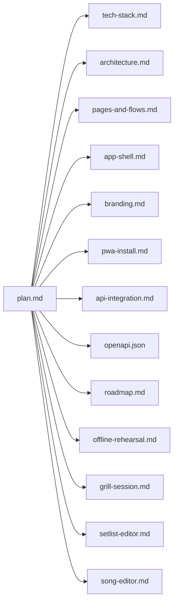

# Worship Viewer — frontend plan (index)

This folder holds the **living design** for the Worship Viewer PWA: mobile-first, iPad-friendly, offline-capable player cache, Tauri-ready SPA, chordlib via WASM, and a Cmd-K command palette on **tablet and desktop** (phones use simple search).

## Documents

| Doc | Purpose |
|-----|---------|
| [tech-stack.md](./tech-stack.md) | Libraries, monorepo, rejected alternatives |
| [architecture.md](./architecture.md) | Layers, ports, offline, sync/Tauri, WASM |
| [pages-and-flows.md](./pages-and-flows.md) | Routes, auth gate, navigation diagram |
| [app-shell.md](./app-shell.md) | Shell layout, lists, long-press, search vs Cmd-K |
| [branding.md](./branding.md) | Tokens, assets, intake checklist |
| [pwa-install.md](./pwa-install.md) | Manifest, SW, install UX per platform |
| [api-integration.md](./api-integration.md) | OpenAPI codegen, auth, pagination, blobs |
| [openapi.json](./openapi.json) | Vendored Worship Viewer API OpenAPI 3.0 spec (refresh from production) |
| [roadmap.md](./roadmap.md) | Phased delivery and exit criteria |
| [offline-rehearsal.md](./offline-rehearsal.md) | E4 manual airplane-mode rehearsal script |
| [grill-session.md](./grill-session.md) | Design review question bank + recorded answers |
| [epic-e1-action-plan.md](./epic-e1-action-plan.md) | E1 step-by-step implementation checklist |
| [epic-e2-action-plan.md](./epic-e2-action-plan.md) | E2 step-by-step implementation checklist |
| [setlist-editor.md](./setlist-editor.md) | Setlist editor route: UX, PATCH/reorder, picker, permissions |
| [song-editor.md](./song-editor.md) | Song editor route: ChordPro + WASM preview, PATCH, permissions |

## Decision log

| Date | Decision | Rationale |
|------|----------|-----------|
| — | **Vite + React SPA** (not Next.js) | Same static `dist/` for PWA + Tauri; no Node runtime in shell. |
| — | **TanStack Router + Query** | Type-safe routes; infinite queries for load-more lists. |
| — | **Dexie + Workbox** | Offline setlist player + blob mirror; precache shell. |
| — | **chordlib in-repo WASM** (`crates/chordlib-wasm`) | Full control; wrap `chordlib` with wasm-bindgen. |
| — | **Same-origin deployment** | Cookie auth; `credentials: 'include'`. |
| — | **Offline: auto-cache recent setlists** | Last N setlists opened in player; LRU + byte budget; **no user “pin offline” in MVP** (automatic retention only). |
| — | **Auth: OAuth + OTP** | Match API: `/auth/login` + `/auth/otp/*`. |
| — | **Dark default** | *Superseded:* default appearance follows **system** until user chooses a theme; see **Branding grill (2026-04-20)** in [branding.md](./branding.md) / [grill-session.md](./grill-session.md). |
| 2026-04-20 | **Shell: bottom nav only** (no side rail); search top-left, avatar top-right, tabs bottom-left, **+** bottom-right — floating margins | Matches mobile-first + grill session; desktop does not switch to a rail. |
| 2026-04-20 | **`/` → `/collections`** | Default landing tab is Collections. |
| 2026-04-20 | **Player:** `/player?type=&id=` (no app shell); API still `GET .../player` per resource | Single player route; PWA standalone removes browser chrome for fullscreen. |
| 2026-04-20 | **Phone:** simple search only; **Cmd-K** on iPad (keyboard) + desktop | Avoid palette on small touch-first phones. |
| 2026-04-20 | **Profile menu** includes **Sessions** after Teams | Account surface parity with `/sessions` route. |
| 2026-04-20 | **Offline:** indicator **near avatar** until online; Create disabled with explanation | Compact status vs full-width banner. |
| 2026-04-20 | **Offline/cache (grill):** remote authoritative when online; **no Dexie fallback** on failed online fetch; **full wipe** on logout and on **401**; **no offline pin**; byte budget = **all** Dexie offline playback data; LRU eviction **grace:** finish current blob/item then block advance; open tabs not torn down by eviction, **reload** re-resolves cache | [architecture.md](./architecture.md), [api-integration.md](./api-integration.md), [grill-session.md](./grill-session.md). |
| 2026-04-20 | **Offline/cache (grill 2):** LRU touch = **player open**; stale data until **next player open** then refetch; **partial mirrors** OK; **SW update** = toast, user reload; **`/me`** on **focus**; **CSRF** server/cookie assumption; **logout offline** = clear local, defer server POST | Same trio of docs + recorded table in [grill-session.md](./grill-session.md). |
| 2026-04-20 | **Offline/cache (grill 3):** connectivity **immediate**; **ignore** API `Cache-Control` for mirror policy; quota → **LRU evict + notify**; MVP offline player = **setlists only**; pagination **no** `hasNextPage` if `X-Total-Count` missing; pull-to-refresh → **scroll top** | [architecture.md](./architecture.md), [api-integration.md](./api-integration.md), [app-shell.md](./app-shell.md), [grill-session.md](./grill-session.md). |
| 2026-04-20 | **Setlist editor (grill):** lazy `Song` detail; **`nr` null** (position-only); default + **pinnable** slot `key`; **`not_a_song`** not addable; **fetch all** `.../songs` pages; **PATCH** preferred; debounced saves + **flush on route change**; **optimistic** reorder + rollback; **auto-save then Play**; **move/delete setlist** list-only; **last-write-wins** conflicts; **block save** on bad `SongLink`s; modal add + **Cmd-K**; duplicates **allowed**; **swipe** remove; read-only editor but **Play** if readable; empty state + **simple** skeleton; back to list **scroll top**; **toast** + **Retry-After** on 429; title **wrap 2 lines**; **i18n** from day one; **keyboard/SR** reorder required; **snackbar undo** | [setlist-editor.md](./setlist-editor.md). |
| 2026-04-20 | **Song editor (grill):** **hybrid** ChordPro source + WASM preview; **debounced PATCH** + flush on leave/Play; **full `PatchSongData` snapshot** per save; **strict** parse — **block save** on parse errors; **block editor** until WASM loads; **`not_a_song` read-only** in editor; **blobs** not managed in editor v1 (player scope); **like** list-only; **move/delete** list-only; **Cmd-K** no editor extras; **last-write-wins**; read-only offline; **full metadata strip** (subtitle, languages, artists, copyright, tempo, time, key); headline = **`titles[0]`** | [song-editor.md](./song-editor.md), [grill-session.md](./grill-session.md) (table “Song editor grill”). |
| 2026-04-20 | **Tech stack & PWA (grill):** production **same origin** for SPA + API; **no** Workbox runtime API cache (precache + nav fallback only); partial mirror **heal** = **next successful online fetch**; SW update **never forced** in MVP; **separate origins** for staging vs prod PWA; **no** SW/offline telemetry pipeline in v1; E2E = **Playwright** + **manual/periodic SW smoke**; **minimal SW** until **E4** (offline Dexie); **fixed** pnpm + `packages/chordlib-wasm` layout; **i18next** early scaffold + **≥1** extra locale | [tech-stack.md](./tech-stack.md), [pwa-install.md](./pwa-install.md), [architecture.md](./architecture.md), [grill-session.md](./grill-session.md) (table “Tech stack & PWA grill”). |
| 2026-04-21 | **Interactive grill (session):** docs use **E1–E10** only (no legacy “Phase” for epics); **E1 exit blocked** until [branding.md](./branding.md) checklist **complete**; production **SPA at `/`**; **frontend** owns OpenAPI codegen on API bumps; **MVP locales English + German**; **Playwright + minimal SW sanity** in **E10**; shell/player/API/PWA decisions per [grill-session.md](./grill-session.md) “Interactive grill (2026-04-21)”. | Same + [roadmap.md](./roadmap.md), [app-shell.md](./app-shell.md), [pages-and-flows.md](./pages-and-flows.md), [api-integration.md](./api-integration.md). |
| 2026-04-21 | **IDB quota (refinement):** if LRU eviction is insufficient, show a **blocking prompt** to clear offline data — extends 2026-04-20 “evict + notify” with a stronger path for hard failures. | [architecture.md](./architecture.md), [grill-session.md](./grill-session.md). |
| 2026-04-21 | **Roadmap:** **E6** is **library import/export** (ChordPro/WorshipPro/PDF, **+** menu **New** vs **Import**, long-press **Export**); former content-editors/player/sync/polish epics shift to **E7–E10**. | [roadmap.md](./roadmap.md). |
| 2026-04-21 | **E1 foundation grill:** E1 uses a **protected `/` stub** only (no hub lists until E2); **minimal Dexie** + shared **clearAllLocalData** for logout/401; **browser-mapped en/de** and **system** appearance until E4 Settings; **no** bottom nav / Cmd-K / list search in E1; **manual** exit smoke (Playwright in E10). | [grill-session.md](./grill-session.md#e1-foundation-grill-2026-04-21), [epic-e1-action-plan.md](./epic-e1-action-plan.md), [roadmap.md](./roadmap.md), [pages-and-flows.md](./pages-and-flows.md). |
| 2026-04-21 | **E1 interactive grill (user session):** **`app/` only** codegen; **`openapi:sync`** **local spec only**; dev **proxy (recommended)** + **cross-origin** documented; **login tabs** OAuth \| OTP; **`return_to`** **query-only** (no sessionStorage mirror); **persist locale** + **`?lang=`** QA override; **`/me`** **`staleTime` ~15 min** + focus + post-login refetch; **offline logout** = clear local + **minimal queue** for server logout; **Vitest** for **pure utils**; **unknown routes** → login if unauth else **simple not-found**. | [grill-session.md](./grill-session.md#e1-interactive-grill--user-session-resolved), [epic-e1-action-plan.md](./epic-e1-action-plan.md#0-resolved-product-choices-interactive-grill). |
| 2026-04-20 | **E2 interactive grill (user session):** hub **tap** targets **player**; **E2** = **silent no-op** (normal UI, no navigation, no **`console`**); **`+`** and **profile** stub entries (**Settings** / **Teams** / **Sessions** / **Install**) and context **Play** = **normal appearance**, **no-op**; **Delete** **live** when API supports; **docs** updated **same epic** as code. | [grill-session.md](./grill-session.md#e2-interactive-grill-user-session-resolved), [epic-e2-action-plan.md](./epic-e2-action-plan.md#0-resolved-product-choices-interactive-grill). |
| 2026-04-20 | **Branding grill (session):** primary **`oklch(0.55 0.21 27)`** (~`#d01d21`); **primary + tints only**; **system default** theme until user pins Light/Dark/browser; **Rubik** WOFF2 (UI + lyrics MVP); assets from **`resources/*.png`**; PWA **`name`** Worship Viewer / **`short_name`** Worship / **`theme_color`** primary; login tagline + **imprint / privacy / terms** URLs; **warm minimal** voice, **worship team** persona; **DE** keeps English product name; denomination imagery **open**. | [branding.md](./branding.md), [grill-session.md](./grill-session.md) (“Branding grill”), [pwa-install.md](./pwa-install.md). |
| 2026-04-27 | **E5 before E4 (sequencing):** shipped **teams + sessions** (`/teams`, `/teams/:id`, `/sessions`) on authenticated **online** APIs; **E4** (offline Dexie mirror, Settings, airplane-mode rehearsal) remains a **separate** follow-up. OpenAPI: added **`CreateTeamInvitation`** (`email`) for `POST /teams/.../invitations`. | [roadmap.md](./roadmap.md) (E5), [openapi.json](./openapi.json). |
| 2026-05-21 | **E6 (songs v1):** Song editor overflow **Import** + **Export** (ChordPro, Worship Pro, PDF); songs hub long-press **Export**; **`+`** chooser **New** \| **Import** batch via `POST /api/v1/songs`; shared `song-import-export.ts` + Vitest. Setlist/collection export deferred. | [epic-e6-action-plan.md](./epic-e6-action-plan.md), [song-editor.md](./song-editor.md). |
| 2026-05-09 | **E7.1 interactive grill:** **no Play in editor** (E8 wires it); **hub primary tap** opens **`/player`** for setlists like other hubs (**Edit** via long-press / context menu); `/setlists/:id` **not** in `return_to` allowlist (bounce to `/setlists`); **`+` opens `CreateSetlistDialog`** (bottom drawer mirroring `CreateTeamDialog`) — POST only on Create, abandoned setlists left in place; **autosave** = **750 ms debounce + field-diff PATCH + single in-flight + block_input**; **save-state icon** with `aria-live`; **error state** = inline Retry / Discard (no toast for save failures); **offline freeze** with **Resume editing? (Retry / Discard)** prompt on reconnect; **`@dnd-kit` (core + sortable + modifiers + utilities)** for reorder with **grab-focus** keyboard model; **bottom-drawer picker** + **Cmd-K inline** sharing one `useSongPickerQuery` hook; duplicates allowed with **`Already in setlist (×N)`** badge; broken rows (404 / 403 / `not_a_song`) **block autosave** until removed; **GET /setlists/{id} only** + parallel per-slot **`GET /songs/{id}`** after detail resolves (supersedes `…/setlists/{id}/songs` paginated bulk-hydration in [setlist-editor.md](./setlist-editor.md)); per-slot **`Key: …` chip** popover (12 keys + Default); **last-write-wins multi-tab** (no BroadcastChannel/If-Match); **TanStack:** `setQueryData` on detail + stale `hubListKey('setlists', q)` on PATCH, `invalidateQueries` on POST; **required Vitest** for `SongLink[]` helpers / autosave / broken-row / field-diff; **i18n EN + DE** under `setlists.editor.*` and `setlists.create.*`. | [epic-e7.1-action-plan.md](./epic-e7.1-action-plan.md), [setlist-editor.md](./setlist-editor.md) (Pagination + Play sections updated), [grill-session.md](./grill-session.md#e71-interactive-grill--user-session-resolved). |

## Open items (before implementation kickoff)

- [ ] **Branding:** self-host **Rubik** WOFF2, wire **tokens.css**, export **PWA icons + favicon** from `resources/` — **required for E1 exit**; see [branding.md](./branding.md) checklist (color/naming/copy **decided**).
- [ ] **chordlib Rust API:** confirm public functions on `chordlib` crate to freeze WASM exports.

## API reference

- **Vendored spec (repo):** [openapi.json](./openapi.json) — same document as production; update periodically or before codegen changes.
- **Live URL:** `https://app.worshipviewer.com/api/docs/openapi.json`

---

*Implementation follows this index; the Cursor plan file under `.cursor/plans/` is a snapshot — edit these `docs/*.md` files as the source of truth for ongoing design.*
